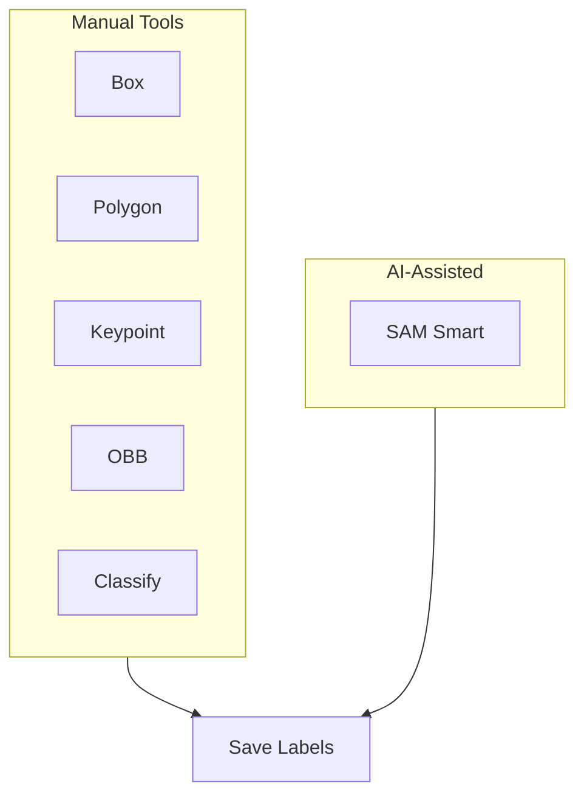
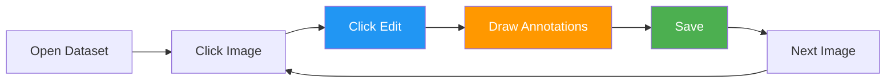
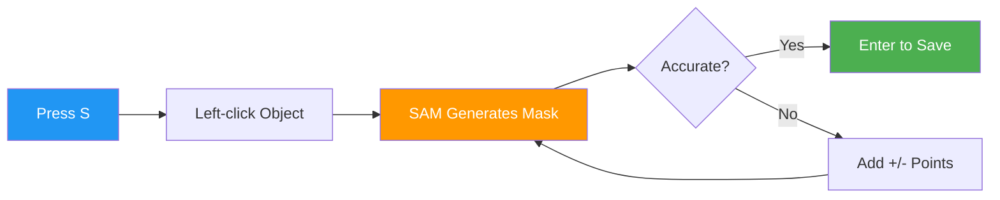

# Annotation Editor

[Ultralytics Platform](https://platform.ultralytics.com) includes a powerful annotation editor for labeling images with bounding boxes, polygons, keypoints, oriented boxes, and classifications. The editor supports manual drawing and SAM-powered smart annotation.

## Supported Task Types

The annotation editor supports all 5 YOLO task types:

| Task                                             | Tool           | Annotation Format                      |
| ------------------------------------------------ | -------------- | -------------------------------------- |
| **[Detect](../../datasets/detect/index.md)**     | Rectangle      | Bounding boxes (x, y, width, height)   |
| **[Segment](../../datasets/segment/index.md)**   | Polygon        | Pixel-precise masks (polygon vertices) |
| **[Pose](../../datasets/pose/index.md)**         | Keypoint       | 17-point COCO skeleton                 |
| **[OBB](../../datasets/obb/index.md)**           | Oriented Box   | Rotated bounding boxes (4 corners)     |
| **[Classify](../../datasets/classify/index.md)** | Class Selector | Image-level labels                     |

### Task Details

??? info "Object Detection"

    **What it does:** Identifies objects and their locations with axis-aligned bounding boxes.

    **Label format:** [`class_id center_x center_y width height`](../../datasets/detect/index.md#ultralytics-yolo-format) (all normalized 0-1)

    **Example:** `0 0.5 0.5 0.2 0.3` — Class 0 centered at (50%, 50%) with 20% width and 30% height

    **Use cases:** Inventory counting, traffic monitoring, wildlife detection, security systems

??? info "Instance Segmentation"

    **What it does:** Creates pixel-precise masks for each object instance.

    **Label format:** [`class_id x1 y1 x2 y2 x3 y3 ...`](../../datasets/segment/index.md#ultralytics-yolo-format) (polygon vertices, normalized 0-1)

    **Example:** `0 0.1 0.1 0.9 0.1 0.9 0.9 0.1 0.9` — Quadrilateral mask

    **Use cases:** Medical imaging, autonomous vehicles, photo editing, agricultural analysis

??? info "Pose Estimation"

    **What it does:** Detects body keypoints for skeleton tracking.

    **Label format:** [`class_id cx cy w h kx1 ky1 v1 kx2 ky2 v2 ...`](../../datasets/pose/index.md#ultralytics-yolo-format)

    - Visibility flags: `0`=not labeled, `1`=labeled but occluded, `2`=labeled and visible

    **Example:** `0 0.5 0.5 0.2 0.3 0.6 0.7 2 0.4 0.8 1` — Person with 2 keypoints

    **Use cases:** Sports analysis, physical therapy, animation, gesture recognition

??? info "Oriented Bounding Box (OBB)"

    **What it does:** Detects rotated objects with angle-aware bounding boxes.

    **Label format:** [`class_id x1 y1 x2 y2 x3 y3 x4 y4`](../../datasets/obb/index.md#yolo-obb-format) (four corner points, normalized)

    **Example:** `0 0.1 0.1 0.9 0.1 0.9 0.9 0.1 0.9` — Rotated rectangle

    **Use cases:** Aerial imagery, document analysis, manufacturing inspection, ship detection

??? info "Image Classification"

    **What it does:** Assigns a single label to the entire image.

    **Label format:** [Folder-based](../../datasets/classify/index.md#dataset-structure-for-yolo-classification-tasks) — images organized by class name (`train/cats/`, `train/dogs/`)

    **Use cases:** Content moderation, quality control, medical diagnosis, scene recognition

## Getting Started

To annotate images:

1. Navigate to your dataset
2. Click on an image to open the fullscreen viewer
3. Click `Edit` to enter annotation mode
4. Select your annotation tool from the toolbar
5. Draw annotations on the image
6. Click `Save` when finished

## Annotation Modes

The editor provides two annotation modes, selectable from the toolbar:

| Mode      | Description                                             | Shortcut |
| --------- | ------------------------------------------------------- | -------- |
| **Draw**  | Manual annotation with task-specific tools              | `V`      |
| **Smart** | SAM-powered interactive annotation (detect/segment/OBB) | `S`      |

## Manual Annotation Tools

### Bounding Box (Detect)

Draw rectangular boxes around objects:

1. Enter edit mode and select `Draw`
2. Click and drag to draw a rectangle
3. Release to complete the box
4. Select a class from the dropdown

!!! tip "Resize and Move"

    - Drag 8 corner/edge handles to resize
    - Drag the center to move
    - Press `Delete` or `Backspace` to remove selected annotation

### Polygon (Segment)

Draw precise polygon masks:

1. Enter edit mode and select `Draw`
2. Click to add vertices
3. Right-click or press `Enter` to close the polygon
4. Select a class from the dropdown

!!! tip "Edit Vertices"

    - Drag individual vertices to adjust
    - Drag the entire polygon to move
    - Click on a vertex and press `Delete` to remove it

### Keypoint (Pose)

Place [17 COCO keypoints](../../datasets/pose/index.md#ultralytics-yolo-format) for human pose:

1. Enter edit mode and select `Draw`
2. Click to place keypoints in sequence
3. Follow the [COCO skeleton order](../../datasets/pose/index.md)

The 17 COCO keypoints are:

| #   | Keypoint       | #   | Keypoint    |
| --- | -------------- | --- | ----------- |
| 1   | Nose           | 10  | Left wrist  |
| 2   | Left eye       | 11  | Right wrist |
| 3   | Right eye      | 12  | Left hip    |
| 4   | Left ear       | 13  | Right hip   |
| 5   | Right ear      | 14  | Left knee   |
| 6   | Left shoulder  | 15  | Right knee  |
| 7   | Right shoulder | 16  | Left ankle  |
| 8   | Left elbow     | 17  | Right ankle |
| 9   | Right elbow    |     |             |

!!! info "Keypoint Visibility"

    Each keypoint has a visibility flag: `0` = not labeled, `1` = labeled but occluded, `2` = labeled and visible. Occluded keypoints (behind other objects) should be marked with visibility `1` — the model learns to infer their position.

### Oriented Bounding Box (OBB)

Draw rotated boxes for angled objects:

1. Enter edit mode and select `Draw`
2. Click and drag to draw an initial box
3. Use the rotation handle to adjust angle
4. Drag corner handles to resize
5. Select a class from the dropdown

### Classification (Classify)

Assign image-level class labels:

1. Enter edit mode
2. A side panel appears with class selection buttons
3. Click on class buttons or press number keys `1-9`

## SAM Smart Annotation

[Segment Anything Model (SAM)](https://docs.ultralytics.com/models/sam/) enables intelligent annotation with just a few clicks. Smart mode is available for **detect**, **segment**, and **OBB** tasks.

1. Enter edit mode and select `Smart` or press `S`
2. **Left-click** to add positive points (include this area)
3. **Right-click** to add negative points (exclude this area)
4. SAM generates a precise mask in real-time
5. Press `Enter` or `Escape` to save the annotation

!!! tip "SAM Tips"

    - Start with a positive click on the object center
    - Add negative clicks to exclude background
    - Hold `Alt`/`Option` to invert click behavior (left-click becomes negative, right-click becomes positive)
    - Works best for distinct objects with clear edges
    - Use 2-3 positive points for elongated objects

SAM smart annotation can generate:

- **Polygons** for segmentation tasks
- **Bounding boxes** for detection tasks
- **Oriented boxes** for OBB tasks

!!! warning "SAM Task Support"

    SAM smart annotation is only available for **detect**, **segment**, and **OBB** tasks. Classification and pose tasks require manual annotation.

## Class Sidebar

The annotation editor includes a collapsible class sidebar on the right side of the canvas. The sidebar provides:

- **Search classes**: Filter the class list by typing in the search field. Press `Enter` on an exact match to select it, or create a new class if no match exists.
- **Create new class inline**: Click `Add class` at the bottom of the list, type a name, and optionally pick a custom color. Press `Enter` to create.
- **Edit class name inline**: Hover over a class name and click the pencil icon to rename it.
- **Color picker**: Click the color swatch next to any class to change its color.
- **Per-class annotation count**: Each class row shows a superscript count of annotations.
- **Expand/collapse**: Click the chevron to expand a class and see individual annotations listed below it.
- **Bidirectional hover highlighting**: Hovering an annotation on the canvas highlights it in the sidebar, and vice versa. The sidebar auto-scrolls and auto-expands to the relevant class.
- **Hide/show individual annotations**: Click the eye icon on any annotation row to toggle its visibility on the canvas.
- **Delete annotations**: Click the trash icon on any annotation row to delete it.
- **Keyboard shortcuts**: Press `1-9` to quickly select the first 9 classes.

## Context Menu

Right-click on selected annotations to open a context menu with:

| Action               | Shortcut               |
| -------------------- | ---------------------- |
| Delete Annotation(s) | `Delete` / `Backspace` |
| Bring to Front       | `Cmd/Ctrl+Shift+]`     |
| Send to Back         | `Cmd/Ctrl+Shift+[`     |
| Bring Forward        | `Cmd/Ctrl+]`           |
| Send Backward        | `Cmd/Ctrl+[`           |

## Visibility Controls

The visibility dropdown (eye icon) lets you toggle display of individual elements:

| Toggle             | Description                                                                                |
| ------------------ | ------------------------------------------------------------------------------------------ |
| **Annotations**    | Show or hide all annotation overlays                                                       |
| **Class labels**   | Show or hide class name labels on annotations                                              |
| **Show pixels**    | Toggle pixelated rendering for zoom inspection (fullscreen)                                |
| **Crosshairs**     | Show crosshair cursor with pixel coordinates (edit mode)                                   |
| **Nav thumbnails** | Show navigation thumbnail strip (fullscreen)                                               |
| **Show all**       | Toggle annotations, labels, crosshairs, and thumbnails at once (does not affect pixelated) |

## Crosshair Cursor

In edit mode, a crosshair overlay tracks the cursor position and displays pixel coordinates on the canvas. This helps place annotations with precision. Toggle it via the visibility dropdown.

## SAM Hover Preview

In Smart mode for **segment** tasks, SAM provides a real-time mask preview as you hover over the image — before clicking any points. This lets you see the predicted segmentation boundary and decide where to click. Once you add positive or negative points, the preview updates to reflect your refinements.

## Polygon Vertex Editing

For segment annotations, you can edit polygon vertices after drawing:

- **Move vertices**: Drag any vertex handle to reposition it
- **Delete vertices**: Select a vertex and press `Delete` to remove it

## Class Management

### Creating Classes

Define annotation classes for your dataset in the `Classes` tab:

1. Navigate to the `Classes` tab
2. Use the input field at the bottom to type a class name
3. Click `Add` or press `Enter`
4. A color is assigned automatically from the Ultralytics palette

### Add New Class During Annotation

You can create new classes directly while annotating without leaving the editor:

1. Draw an annotation on the image
2. In the class dropdown, click `Add New Class`
3. Enter the class name
4. Press Enter to create and assign

This allows for a seamless workflow where you can define classes as you encounter new object types in your data.

!!! tip "Unified Classes Table"

    All classes across your dataset are managed in a unified table. Changes to class names or colors apply throughout the entire dataset automatically.

### Editing Classes

- **Rename**: Click a class name in the table to edit it inline
- **Change color**: Click the color swatch to open the color picker
- **Search**: Use the search field to filter classes by name
- **Sort**: Click column headers to sort by name, label count, or image count

### Class Colors

Each class is assigned a color from the Ultralytics palette. You can customize colors using the color picker on the `Classes` tab. Colors are consistent across the platform for easy recognition.

## Keyboard Shortcuts

Efficient annotation with keyboard shortcuts:

=== "General"

    | Shortcut               | Action                     |
    | ---------------------- | -------------------------- |
    | `Cmd/Ctrl+S`           | Save annotations           |
    | `Cmd/Ctrl+Z`           | Undo                       |
    | `Cmd/Ctrl+Shift+Z`     | Redo                       |
    | `Cmd/Ctrl+Y`           | Redo (alternative)         |
    | `Escape`               | Save / Deselect / Exit     |
    | `Delete` / `Backspace` | Delete selected annotation |
    | `1-9`                  | Select class 1-9           |
    | `Cmd/Ctrl+Scroll`      | Zoom in/out                |
    | `Shift+Click`          | Multi-select annotations   |
    | `Cmd/Ctrl+A`           | Select all annotations     |

=== "Modes"

    | Shortcut | Action             |
    | -------- | ------------------ |
    | `V`      | Draw mode (manual) |
    | `S`      | Smart mode (SAM)   |

=== "Drawing"

    | Shortcut      | Action                                              |
    | ------------- | --------------------------------------------------- |
    | `Click+Drag`  | Draw bounding box (detect/OBB)                      |
    | `Click`       | Add polygon point (segment) / Place keypoint (pose) |
    | `Right-click` | Complete polygon / Add SAM negative point           |
    | `Enter`       | Complete polygon / Save SAM annotation              |
    | `Escape`      | Save SAM annotation / Deselect / Exit edit mode     |

=== "Arrange (Z-Order)"

    | Shortcut           | Action         |
    | ------------------ | -------------- |
    | `Cmd/Ctrl+]`       | Bring forward  |
    | `Cmd/Ctrl+[`       | Send backward  |
    | `Cmd/Ctrl+Shift+]` | Bring to front |
    | `Cmd/Ctrl+Shift+[` | Send to back   |

??? tip "View All Shortcuts"

    Click the keyboard icon in the annotation toolbar to open the shortcuts reference.

## Undo/Redo

The annotation editor maintains a full undo/redo history:

- **Undo**: `Cmd/Ctrl+Z`
- **Redo**: `Cmd/Ctrl+Shift+Z` or `Cmd/Ctrl+Y`

History tracks:

- Adding annotations (single and batch)
- Editing annotations (move, resize, rotate)
- Deleting annotations (single and batch)
- Changing classes (single and batch)
- Reordering annotations (z-order)
- Editing polygon vertices (add, remove, move)
- Moving keypoints

!!! info "Unlimited Undo"

    The undo stack has no fixed limit — you can undo all changes made during the current editing session, back to the original state of the image when you clicked `Edit`.

## Saving Annotations

Annotations are saved when you click `Save` or press `Cmd/Ctrl+S`:

- **Save**: Click the save button or press `Cmd/Ctrl+S`
- **Cancel**: Click cancel to discard changes
- **Escape**: Saves if there are unsaved changes, otherwise exits edit mode

!!! warning "Save Your Work"

    Always save before navigating to another image. Unsaved changes will be lost.

## FAQ

### How accurate is SAM annotation?

SAM provides high-quality masks for most objects. Accuracy depends on:

- Object distinctiveness from background
- Image quality and resolution
- Number of positive/negative points provided

For best results, start with a positive point on the object center and add negative points to exclude nearby objects.

### Can I import existing annotations?

Yes, upload your dataset with [YOLO-format label files](../../datasets/detect/index.md#ultralytics-yolo-format). The Platform automatically parses and displays them in the editor.

### How do I annotate multiple objects of the same class?

After drawing an annotation:

1. Keep the same class selected
2. Draw the next annotation
3. Repeat until all objects are labeled

The keyboard shortcut `1-9` quickly selects classes.

### Can I train on partially annotated datasets?

Yes, but for best results:

- Label all objects of your target classes in each image
- Use the label filter set to `Unannotated` to identify unlabeled images
- Exclude unannotated images from training configuration

### Which tasks support SAM smart annotation?

SAM smart annotation is available for **detect**, **segment**, and **OBB** tasks. Classification and pose tasks use manual annotation only.
