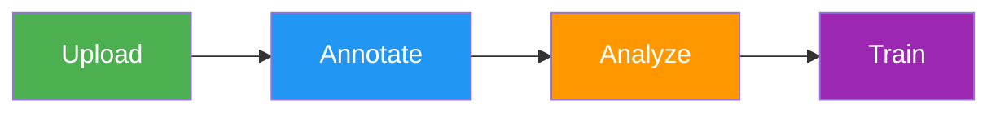

# Data Preparation

Data preparation is the foundation of successful [computer vision](https://www.ultralytics.com/glossary/computer-vision-cv) models. [Ultralytics Platform](https://platform.ultralytics.com) provides comprehensive tools for managing your training data, from upload through annotation to analysis.

## Overview

The Data section of Ultralytics Platform helps you:

- **Upload** images, videos, and archives (ZIP, TAR, GZ)
- **Annotate** with manual drawing tools and SAM-powered smart labeling
- **Analyze** your data with statistics and visualizations
- **Export** in [NDJSON format](../../datasets/detect/index.md#ultralytics-ndjson-format) for local training


## Workflow



| Stage        | Description                                                                                           |
| ------------ | ----------------------------------------------------------------------------------------------------- |
| **Upload**   | Import images, videos, or archives with automatic processing                                          |
| **Annotate** | Label data with bounding boxes, polygons, keypoints, or classifications                               |
| **Analyze**  | View class distributions, spatial heatmaps, and dimension statistics                                  |
| **Export**   | Download in [NDJSON format](../../datasets/detect/index.md#ultralytics-ndjson-format) for offline use |

## Supported Tasks

Ultralytics Platform supports all 5 YOLO task types:

| Task                                             | Description                                 | Annotation Tool   |
| ------------------------------------------------ | ------------------------------------------- | ----------------- |
| **[Detect](../../datasets/detect/index.md)**     | Object detection with bounding boxes        | Rectangle tool    |
| **[Segment](../../datasets/segment/index.md)**   | Instance segmentation with pixel masks      | Polygon tool      |
| **[Pose](../../datasets/pose/index.md)**         | Keypoint estimation (17-point COCO format)  | Keypoint tool     |
| **[OBB](../../datasets/obb/index.md)**           | Oriented bounding boxes for rotated objects | Oriented box tool |
| **[Classify](../../datasets/classify/index.md)** | Image-level classification                  | Class selector    |

!!! info "Task Type Selection"

    The task type is set when creating a dataset and determines which annotation tools are available. You can change it later from the dataset settings, but incompatible annotations won't be displayed after switching.

## Key Features

### Smart Storage

Ultralytics Platform uses Content-Addressable Storage (CAS) for efficient data management:

- **Deduplication**: Identical images stored only once via XXH3-128 hashing
- **Integrity**: Hash-based addressing ensures data integrity
- **Efficiency**: Optimized storage and fast processing

### Dataset URIs

Reference datasets using the `ul://` URI format (see [Using Platform Datasets](../api/index.md#using-platform-datasets)):

```bash
yolo train data=ul://username/datasets/my-dataset
```

This allows training on the platform's datasets from any machine with your [API key](../account/api-keys.md) configured.

!!! example "Use Platform Data from Python"

    ```python
    from ultralytics import YOLO

    model = YOLO("yolo26n.pt")
    model.train(data="ul://username/datasets/my-dataset", epochs=100)
    ```

### Dataset Tabs

Every dataset page provides five tabs:

| Tab         | Description                                                                  |
| ----------- | ---------------------------------------------------------------------------- |
| **Images**  | Browse images in grid, compact, or table view with annotation overlays       |
| **Classes** | View and edit class names, colors, and label counts per class                |
| **Charts**  | Automatic statistics: split distribution, class counts, heatmaps             |
| **Models**  | [Models](../train/models.md) trained on this dataset with metrics and status |
| **Errors**  | Images that failed processing with error details and fix guidance            |

### Statistics and Visualization

The `Charts` tab provides automatic analysis including:

- **Split Distribution**: Donut chart of train/val/test image counts
- **Top Classes**: Donut chart of most frequent annotation classes
- **Image Widths**: Histogram of image width distribution
- **Image Heights**: Histogram of image height distribution
- **Points per Instance**: Polygon vertex or keypoint count distribution (segment/pose datasets)
- **Annotation Locations**: 2D heatmap of bounding box center positions
- **Image Dimensions**: 2D heatmap of width vs height with aspect ratio guide lines

## Quick Links

- [**Datasets**](datasets.md): Upload and manage your training data
- [**Annotation**](annotation.md): Label data with manual and AI-assisted tools

## FAQ

### What file formats are supported for upload?

Ultralytics Platform supports:

**Images:** JPEG, PNG, WebP, BMP, TIFF, HEIC, AVIF, JP2, DNG, MPO (max 50MB each)

**Videos:** MP4, WebM, MOV, AVI, MKV, M4V (max 1GB, frames extracted at 1 FPS, max 100 frames)

**Archives:** ZIP, TAR, TAR.GZ, TGZ, GZ (max 10GB) containing images with optional [YOLO-format labels](../../datasets/detect/index.md#ultralytics-yolo-format)

### What is the maximum dataset size?

Storage limits depend on your plan:

| Plan       | Storage Limit |
| ---------- | ------------- |
| Free       | 100 GB        |
| Pro        | 500 GB        |
| Enterprise | Custom        |

Individual file limits: Images 50MB, Videos 1GB, Archives 10GB

### Can I use my Platform datasets for local training?

Yes! Use the dataset URI format to train locally:

=== "CLI"

    ```bash
    export ULTRALYTICS_API_KEY="your_key"
    yolo train model=yolo26n.pt data=ul://username/datasets/my-dataset epochs=100
    ```

=== "Python"

    ```python
    import os

    os.environ["ULTRALYTICS_API_KEY"] = "your_key"

    from ultralytics import YOLO

    model = YOLO("yolo26n.pt")
    model.train(data="ul://username/datasets/my-dataset", epochs=100)
    ```

Or export your dataset in [NDJSON format](../../datasets/detect/index.md#ultralytics-ndjson-format) for fully offline training.
