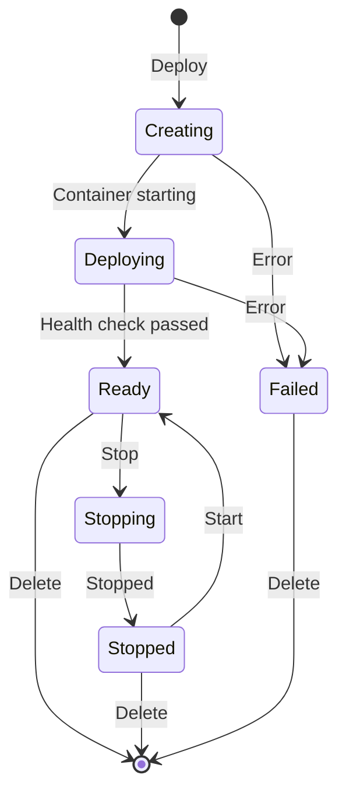
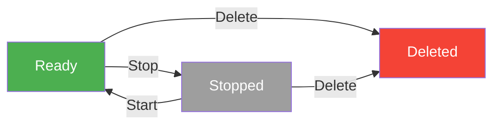

# Dedicated Endpoints

[Ultralytics Platform](https://platform.ultralytics.com) enables deployment of YOLO models to dedicated endpoints in 43 global regions. Each endpoint is a single-tenant service with auto-scaling, a unique endpoint URL, and independent monitoring.


## Create Endpoint

### From the Deploy Tab

Deploy a model from its `Deploy` tab:

1. Navigate to your model
2. Click the **Deploy** tab
3. Select a region from the region table (sorted by latency from your location)
4. Click **Deploy** on the region row

The deployment name is auto-generated from the model name and region city (e.g., `yolo11n-iowa`).

### From the Deployments Page

Create a deployment from the global `Deploy` page in the sidebar:

1. Click **New Deployment**
2. Select a model from the model selector
3. Select a region from the map or table
4. Optionally customize the deployment name and resources
5. Click **Deploy Model**


### Deployment Lifecycle



### Region Selection

Choose from 43 regions worldwide. The interactive region map and table show:

- **Region pins**: Color-coded by latency (green < 100ms, yellow < 200ms, red > 200ms)
- **Deployed regions**: Highlighted with a "Deployed" badge
- **Deploying regions**: Animated pulse indicator
- **Bidirectional highlighting**: Hover on the map highlights the table row, and vice versa


The region table on the model `Deploy` tab includes:

| Column       | Description                              |
| ------------ | ---------------------------------------- |
| **Location** | City and country with flag icon          |
| **Zone**     | Region identifier                        |
| **Latency**  | Measured ping time (median of 3 pings)   |
| **Distance** | Distance from your location in km        |
| **Actions**  | Deploy button or "Deployed" status badge |

!!! note "New Deployment Dialog"

    The `New Deployment` dialog (from the global `Deploy` page) shows a simpler region table with only Location, Latency, and Select columns.

!!! tip "Choose Wisely"

    Select the region closest to your users for lowest latency. Use the **Rescan** button to re-measure latency from your current location.

## Available Regions

=== "Americas (14)"

    | Zone                    | Location               |
    | ----------------------- | ---------------------- |
    | us-central1             | Iowa, USA              |
    | us-east1                | South Carolina, USA    |
    | us-east4                | Northern Virginia, USA |
    | us-east5                | Columbus, USA          |
    | us-south1               | Dallas, USA            |
    | us-west1                | Oregon, USA            |
    | us-west2                | Los Angeles, USA       |
    | us-west3                | Salt Lake City, USA    |
    | us-west4                | Las Vegas, USA         |
    | northamerica-northeast1 | Montreal, Canada       |
    | northamerica-northeast2 | Toronto, Canada        |
    | northamerica-south1     | Queretaro, Mexico      |
    | southamerica-east1      | Sao Paulo, Brazil      |
    | southamerica-west1      | Santiago, Chile        |

=== "Europe (13)"

    | Zone              | Location               |
    | ----------------- | ---------------------- |
    | europe-west1      | St. Ghislain, Belgium  |
    | europe-west2      | London, UK             |
    | europe-west3      | Frankfurt, Germany     |
    | europe-west4      | Eemshaven, Netherlands |
    | europe-west6      | Zurich, Switzerland    |
    | europe-west8      | Milan, Italy           |
    | europe-west9      | Paris, France          |
    | europe-west10     | Berlin, Germany        |
    | europe-west12     | Turin, Italy           |
    | europe-north1     | Hamina, Finland        |
    | europe-north2     | Stockholm, Sweden      |
    | europe-central2   | Warsaw, Poland         |
    | europe-southwest1 | Madrid, Spain          |

=== "Asia-Pacific (12)"

    | Zone                 | Location               |
    | -------------------- | ---------------------- |
    | asia-east1           | Changhua, Taiwan       |
    | asia-east2           | Kowloon, Hong Kong     |
    | asia-northeast1      | Tokyo, Japan           |
    | asia-northeast2      | Osaka, Japan           |
    | asia-northeast3      | Seoul, South Korea     |
    | asia-south1          | Mumbai, India          |
    | asia-south2          | Delhi, India           |
    | asia-southeast1      | Jurong West, Singapore |
    | asia-southeast2      | Jakarta, Indonesia     |
    | asia-southeast3      | Bangkok, Thailand      |
    | australia-southeast1 | Sydney, Australia      |
    | australia-southeast2 | Melbourne, Australia   |

=== "Middle East & Africa (4)"

    | Zone          | Location                   |
    | ------------- | -------------------------- |
    | africa-south1 | Johannesburg, South Africa |
    | me-central1   | Doha, Qatar                |
    | me-central2   | Dammam, Saudi Arabia       |
    | me-west1      | Tel Aviv, Israel           |

## Endpoint Configuration

### New Deployment Dialog

The `New Deployment` dialog provides:

| Setting             | Description                  | Default |
| ------------------- | ---------------------------- | ------- |
| **Model**           | Select from completed models | -       |
| **Region**          | Deployment region            | -       |
| **Deployment Name** | Auto-generated, editable     | -       |
| **CPU Cores**       | CPU allocation (1-8)         | 1       |
| **Memory (GB)**     | Memory allocation (1-32 GB)  | 2       |


Resource settings are available under the collapsible **Resources** section. Deployments use scale-to-zero by default (min instances = 0, max instances = 1) — you only pay for active inference time.

!!! note "Auto-Generated Names"

    The deployment name is automatically generated from the model name and region city (e.g., `yolo11n-iowa`). If you deploy the same model to the same region again, a numeric suffix is added (e.g., `yolo11n-iowa-2`).

### Deploy Tab (Quick Deploy)

When deploying from the model's `Deploy` tab, endpoints are created with default resources (1 CPU, 2 GB memory) with scale-to-zero enabled. The deployment name is auto-generated.

## Manage Endpoints

### View Modes

The deployments list supports three view modes:

| Mode        | Description                                               |
| ----------- | --------------------------------------------------------- |
| **Cards**   | Full detail cards with logs, code examples, predict panel |
| **Compact** | Grid of smaller cards with key metrics                    |
| **Table**   | DataTable with sortable columns and search                |


### Deployment Card (Cards View)

Each deployment card in the cards view shows:

- **Header**: Name, region flag, status badge, start/stop/delete buttons
- **Endpoint URL**: Copyable URL with link to API docs
- **Metrics**: Request count (24h), P95 latency, error rate
- **Health check**: Live health indicator with latency and manual refresh
- **Tabs**: `Logs`, `Code`, and `Predict`

The `Logs` tab shows recent log entries with severity filtering (All / Errors). The `Code` tab shows ready-to-use code examples in Python, JavaScript, and cURL with your actual endpoint URL and API key. The `Predict` tab provides an inline predict panel for testing directly on the deployment.

### Deployment Statuses

| Status        | Description                             |
| ------------- | --------------------------------------- |
| **Creating**  | Deployment is being set up              |
| **Deploying** | Container is starting                   |
| **Ready**     | Endpoint is live and accepting requests |
| **Stopping**  | Endpoint is shutting down               |
| **Stopped**   | Endpoint is paused (no billing)         |
| **Failed**    | Deployment failed (see error message)   |

### Endpoint URL

Each endpoint has a unique URL, for example:

```
https://predict-abc123.run.app
```


Click the copy button to copy the URL. Click the docs icon to view the auto-generated API documentation for the endpoint.

## Lifecycle Management

Control your endpoint state:



| Action     | Description                     |
| ---------- | ------------------------------- |
| **Start**  | Resume a stopped endpoint       |
| **Stop**   | Pause the endpoint (no billing) |
| **Delete** | Permanently remove endpoint     |

### Stop Endpoint

Stop an endpoint to pause billing:

1. Click the pause icon on the deployment card
2. Endpoint status changes to "Stopping" then "Stopped"

Stopped endpoints:

- Don't accept requests
- Don't incur charges
- Can be restarted anytime

### Delete Endpoint

Permanently remove an endpoint:

1. Click the delete (trash) icon on the deployment card
2. Confirm deletion in the dialog

!!! warning "Permanent Action"

    Deletion is immediate and permanent. You can always create a new endpoint.

## Using Endpoints

### Authentication

Each deployment is created with an API key from your account. Include it in requests:

```bash
Authorization: Bearer YOUR_API_KEY
```

The API key prefix is displayed on the deployment card footer for identification. Generate keys from [API Keys](../account/api-keys.md).

### No Rate Limits

Dedicated endpoints are **not subject to the Platform API rate limits**. Requests go directly to your dedicated service, so throughput is limited only by your endpoint's CPU, memory, and scaling configuration. This is a key advantage over [shared inference](inference.md), which is rate-limited to 20 requests/min per API key.

### Request Example

=== "Python"

    ```python
    import requests

    # Deployment endpoint
    url = "https://predict-abc123.run.app/predict"

    # Headers with your deployment API key
    headers = {"Authorization": "Bearer YOUR_API_KEY"}

    # Inference parameters
    data = {"conf": 0.25, "iou": 0.7, "imgsz": 640}

    # Send image for inference
    with open("image.jpg", "rb") as f:
        response = requests.post(url, headers=headers, data=data, files={"file": f})

    print(response.json())
    ```

=== "JavaScript"

    ```javascript
    // Build form data with image and parameters
    const formData = new FormData();
    formData.append("file", fileInput.files[0]);
    formData.append("conf", "0.25");
    formData.append("iou", "0.7");
    formData.append("imgsz", "640");

    // Send image for inference
    const response = await fetch(
      "https://predict-abc123.run.app/predict",
      {
        method: "POST",
        headers: { Authorization: "Bearer YOUR_API_KEY" },
        body: formData,
      }
    );

    const result = await response.json();
    console.log(result);
    ```

=== "cURL"

    ```bash
    curl -X POST \
      "https://predict-abc123.run.app/predict" \
      -H "Authorization: Bearer YOUR_API_KEY" \
      -F "file=@image.jpg" \
      -F "conf=0.25" \
      -F "iou=0.7" \
      -F "imgsz=640"
    ```

### Request Parameters

| Parameter   | Type   | Default | Description                   |
| ----------- | ------ | ------- | ----------------------------- |
| `file`      | file   | -       | Image file (required)         |
| `conf`      | float  | 0.25    | Minimum confidence threshold  |
| `iou`       | float  | 0.7     | NMS IoU threshold             |
| `imgsz`     | int    | 640     | Input image size              |
| `normalize` | string | -       | Return normalized coordinates |

### Response Format

Same as [shared inference](inference.md#response) with task-specific fields.

## Pricing

Dedicated endpoints bill based on:

| Component    | Rate                 |
| ------------ | -------------------- |
| **CPU**      | Per vCPU-second      |
| **Memory**   | Per GB-second        |
| **Requests** | Per million requests |

!!! tip "Cost Optimization"

    - Use scale-to-zero for development endpoints
    - Set appropriate max instances
    - Monitor usage in the [Monitoring](monitoring.md) dashboard
    - Review costs in [Settings > Billing](../account/billing.md)

## FAQ

### How many endpoints can I create?

Endpoint limits depend on plan:

- **Free**: Up to 3 deployments
- **Pro**: Up to 10 deployments
- **Enterprise**: Unlimited deployments

Each model can still be deployed to multiple regions within your plan quota.

### Can I change the region after deployment?

No, regions are fixed. To change regions:

1. Delete the existing endpoint
2. Create a new endpoint in the desired region

### How do I handle multi-region deployment?

For global coverage:

1. Deploy to multiple regions
2. Use a load balancer or DNS routing
3. Route users to the nearest endpoint

### What's the cold start time?

Cold start time depends on model size and whether the container is already cached in the region. Typical ranges:

| Scenario            | Cold Start     |
| ------------------- | -------------- |
| Cached container    | ~5-15 seconds  |
| First deploy/region | ~15-45 seconds |

The health check uses a 55-second timeout to accommodate worst-case cold starts.

### Can I use custom domains?

Custom domains are coming soon. Currently, endpoints use platform-generated URLs.
