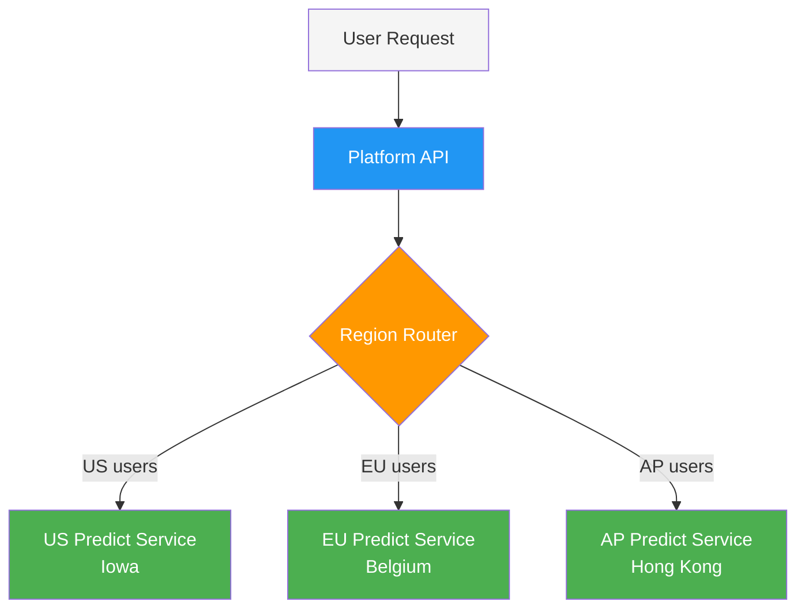

# Deployment

[Ultralytics Platform](https://platform.ultralytics.com) provides comprehensive deployment options for putting your YOLO models into production. Test models with browser-based inference, deploy to dedicated endpoints across 43 global regions, and monitor performance in real-time.

## Overview

The Deployment section helps you:

- **Test** models directly in the browser with the `Predict` tab
- **Deploy** to dedicated endpoints in 43 global regions
- **Monitor** request metrics, logs, and health checks
- **Scale** automatically with traffic (including scale-to-zero)


## Deployment Options

Ultralytics Platform offers multiple deployment paths:

| Option                                  | Description                                              | Best For                |
| --------------------------------------- | -------------------------------------------------------- | ----------------------- |
| **[Predict Tab](inference.md)**         | Browser-based inference with image, webcam, and examples | Development, validation |
| **Shared Inference**                    | Multi-tenant service across 3 regions                    | Light usage, testing    |
| **[Dedicated Endpoints](endpoints.md)** | Single-tenant services across 43 regions                 | Production, low latency |

## Workflow


| Stage         | Description                                                              |
| ------------- | ------------------------------------------------------------------------ |
| **Test**      | Validate model with the [`Predict` tab](inference.md)                    |
| **Configure** | Select region, resources, and deployment name                            |
| **Deploy**    | Create a dedicated endpoint from the [`Deploy` tab](endpoints.md)        |
| **Monitor**   | Track requests, latency, errors, and logs in [Monitoring](monitoring.md) |

## Architecture

### Shared Inference

The shared inference service runs in 3 key regions, automatically routing requests based on your data region:



| Region | Location                |
| ------ | ----------------------- |
| US     | Iowa, USA               |
| EU     | Belgium, Europe         |
| AP     | Hong Kong, Asia-Pacific |

### Dedicated Endpoints

Deploy to 43 regions worldwide on Ultralytics Cloud:

- **Americas**: 14 regions
- **Europe**: 13 regions
- **Asia-Pacific**: 12 regions
- **Middle East & Africa**: 4 regions

Each endpoint is a single-tenant service with:

- Dedicated compute resources (configurable CPU and memory)
- Auto-scaling (scale-to-zero when idle)
- Unique endpoint URL
- Independent monitoring, logs, and health checks

## Deployments Page

Access the global deployments page from the sidebar under `Deploy`. This page shows:

- **World map** with deployed region pins (interactive map)
- **Overview cards**: Total Requests (24h), Active Deployments, Error Rate (24h), P95 Latency (24h)
- **Deployments list** with three view modes: cards, compact, and table
- **New Deployment** button to create endpoints from any completed model


!!! info "Automatic Polling"

    The page polls every 30 seconds for metric updates. When deployments are in a transitional state (creating, deploying, stopping), polling increases to every 2-3 seconds for near-instant feedback.

## Key Features

### Global Coverage

Deploy close to your users with 43 regions covering:

- North America, South America
- Europe, Middle East, Africa
- Asia Pacific, Oceania

### Auto-Scaling

Endpoints scale automatically:

- **Scale to zero**: No cost when idle (default)
- **Scale up**: Handle traffic spikes automatically

!!! tip "Cost Savings"

    Scale-to-zero is enabled by default (min instances = 0). You only pay for active inference time.

### Low Latency

Dedicated endpoints provide:

- Cold start: ~5-15 seconds (cached container), up to ~45 seconds (first deploy)
- Warm inference: 50-200ms (model dependent)
- Regional routing for optimal performance

### Health Checks

Each running deployment includes an automatic health check with:

- Live status indicator (healthy/unhealthy)
- Response latency display
- Auto-retry when unhealthy (polls every 20 seconds)
- Manual refresh button

## Quick Start

Deploy a model in under 2 minutes:

1. Train or upload a model to a project
2. Go to the model's **Deploy** tab
3. Select a region from the latency table
4. Click **Deploy** — your endpoint is live

!!! example "Quick Deploy"

    ```
    Model → Deploy tab → Select region → Click Deploy → Endpoint URL ready
    ```

    Once deployed, use the endpoint URL with your API key to send inference requests from any application.

## Quick Links

- [**Inference**](inference.md): Test models in browser
- [**Endpoints**](endpoints.md): Deploy dedicated endpoints
- [**Monitoring**](monitoring.md): Track deployment performance

## FAQ

### What's the difference between shared and dedicated inference?

| Feature     | Shared          | Dedicated      |
| ----------- | --------------- | -------------- |
| **Latency** | Variable        | Consistent     |
| **Cost**    | Pay per request | Pay for uptime |
| **Scale**   | Limited         | Configurable   |
| **Regions** | 3               | 43             |
| **URL**     | Generic         | Custom         |

### How long does deployment take?

Dedicated endpoint deployment typically takes 1-2 minutes:

1. Image pull (~30s)
2. Container start (~30s)
3. Health check (~30s)

### Can I deploy multiple models?

Yes, each model can have multiple endpoints in different regions. There's no limit on total endpoints (subject to your plan).

### What happens when an endpoint is idle?

With scale-to-zero enabled:

- Endpoint scales down after inactivity
- First request triggers cold start
- Subsequent requests are fast

First requests after an idle period trigger a cold start.
