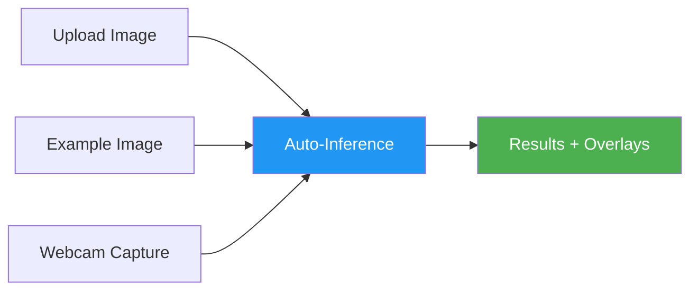

# Inference

[Ultralytics Platform](https://platform.ultralytics.com) provides an inference API for testing trained models. Use the browser-based `Predict` tab for quick validation or the [REST API](../api/index.md#models-api) for programmatic access.


## Predict Tab

Every model includes a `Predict` tab for browser-based inference:

1. Navigate to your model
2. Click the **Predict** tab
3. Upload an image, use an example, or open your webcam
4. View predictions instantly with bounding box overlays


### Input Methods

The predict panel supports multiple input methods:

| Method             | Description                                          |
| ------------------ | ---------------------------------------------------- |
| **Image upload**   | Drag and drop or click to upload an image            |
| **Example images** | Click built-in examples (dataset images or defaults) |
| **Webcam capture** | Live camera feed with single-frame capture           |



### Upload Image

Drag and drop or click to upload:

- **Supported formats**: JPEG, PNG, WebP, AVIF, HEIC, JP2, TIFF, BMP, DNG, MPO
- **Max size**: 10MB
- **Auto-inference**: Results appear automatically after upload

!!! info "Auto-Inference"

    The predict panel runs inference automatically when you upload an image, select an example, or capture a webcam frame. No button click is needed.

### Example Images

The predict panel shows example images from your model's linked dataset. If no dataset is linked, default examples are used:

| Image        | Content                    |
| ------------ | -------------------------- |
| `bus.jpg`    | Street scene with vehicles |
| `zidane.jpg` | Sports scene with people   |

For OBB models, aerial images of boats and airports are shown instead.

!!! tip "Preloaded Images"

    Example images are preloaded when the page loads, so clicking an example triggers near-instant inference with no download wait.

### Webcam

Click the webcam card to start a live camera feed:

1. Grant camera permission when prompted
2. Click the video preview to capture a frame
3. Inference runs automatically on the captured frame
4. Click again to restart the webcam

### View Results

Inference results display:

- **Bounding boxes** with class labels as SVG overlays
- **Confidence scores** for each detection
- **Class colors** from your dataset's color palette (or the Ultralytics default palette)
- **Speed breakdown**: Preprocess, inference, postprocess, and network time


The results panel shows:

| Field               | Description                                      |
| ------------------- | ------------------------------------------------ |
| **Detections list** | Each detection with class name and confidence    |
| **Speed stats**     | Preprocess, inference, postprocess, network (ms) |
| **JSON response**   | Raw API response in a code block                 |

## Inference Parameters

Adjust detection behavior with parameters in the collapsible **Parameters** section:


| Parameter      | Range          | Default | Description                            |
| -------------- | -------------- | ------- | -------------------------------------- |
| **Confidence** | 0.01-1.0       | 0.25    | Minimum confidence threshold           |
| **IoU**        | 0.0-0.95       | 0.70    | NMS IoU threshold                      |
| **Image Size** | 320, 640, 1280 | 640     | Input resize dimension (button toggle) |

!!! note "Auto-Rerun"

    Changing any parameter automatically re-runs inference on the current image with a 500ms debounce. No need to re-upload.

### Confidence Threshold

Filter predictions by confidence:

- **Higher (0.5+)**: Fewer, more certain predictions
- **Lower (0.1-0.25)**: More predictions, some noise
- **Default (0.25)**: Balanced for most use cases

### IoU Threshold

Control Non-Maximum Suppression:

- **Higher (0.7+)**: Allow more overlapping boxes
- **Lower (0.3-0.5)**: Merge nearby detections more aggressively
- **Default (0.70)**: Balanced NMS behavior for most use cases

## Deployment Predict

Each running [dedicated endpoint](endpoints.md) includes a `Predict` tab directly on its deployment card. This uses the deployment's own inference service rather than the shared predict service, letting you test your deployed endpoint from the browser.

## REST API

Access inference programmatically:

### Authentication

Include your API key in requests:

```bash
Authorization: Bearer YOUR_API_KEY
```

!!! warning "API Key Required"

    To run inference from your own scripts, notebooks, or apps, include an API key. Generate one in [`Settings`](../account/api-keys.md) (API Keys section on the Profile tab).

### Endpoint

```
POST https://platform.ultralytics.com/api/models/{modelId}/predict
```

### Request

=== "Python"

    ```python
    import requests

    url = "https://platform.ultralytics.com/api/models/MODEL_ID/predict"
    headers = {"Authorization": "Bearer YOUR_API_KEY"}
    files = {"file": open("image.jpg", "rb")}
    data = {"conf": 0.25, "iou": 0.7, "imgsz": 640}

    response = requests.post(url, headers=headers, files=files, data=data)
    print(response.json())
    ```

=== "cURL"

    ```bash
    curl -X POST \
      "https://platform.ultralytics.com/api/models/MODEL_ID/predict" \
      -H "Authorization: Bearer YOUR_API_KEY" \
      -F "file=@image.jpg" \
      -F "conf=0.25" \
      -F "iou=0.7" \
      -F "imgsz=640"
    ```

=== "JavaScript"

    ```javascript
    const formData = new FormData();
    formData.append("file", fileInput.files[0]);
    formData.append("conf", "0.25");
    formData.append("iou", "0.7");
    formData.append("imgsz", "640");

    const response = await fetch(
      "https://platform.ultralytics.com/api/models/MODEL_ID/predict",
      {
        method: "POST",
        headers: { Authorization: "Bearer YOUR_API_KEY" },
        body: formData,
      }
    );

    const result = await response.json();
    console.log(result);
    ```


### Response

```json
{
    "images": [
        {
            "shape": [1080, 1920],
            "results": [
                {
                    "class": 0,
                    "name": "person",
                    "confidence": 0.92,
                    "box": { "x1": 100, "y1": 50, "x2": 300, "y2": 400 }
                },
                {
                    "class": 2,
                    "name": "car",
                    "confidence": 0.87,
                    "box": { "x1": 400, "y1": 200, "x2": 600, "y2": 350 }
                }
            ],
            "speed": {
                "preprocess": 1.2,
                "inference": 12.5,
                "postprocess": 2.3
            }
        }
    ],
    "metadata": {
        "imageCount": 1,
        "functionTimeCall": 0.018,
        "model": "model.pt",
        "version": {
            "ultralytics": "8.4.14",
            "torch": "2.6.0",
            "torchvision": "0.21.0",
            "python": "3.13.0"
        }
    }
}
```


### Response Fields

| Field                           | Type   | Description                       |
| ------------------------------- | ------ | --------------------------------- |
| `images`                        | array  | List of processed images          |
| `images[].shape`                | array  | Image dimensions [height, width]  |
| `images[].results`              | array  | List of detections                |
| `images[].results[].name`       | string | Class name                        |
| `images[].results[].confidence` | float  | Detection confidence (0-1)        |
| `images[].results[].box`        | object | Bounding box coordinates          |
| `images[].speed`                | object | Processing times in milliseconds  |
| `metadata`                      | object | Request metadata and version info |

### Task-Specific Responses

Response format varies by task:

=== "Detection"

    ```json
    {
      "class": 0,
      "name": "person",
      "confidence": 0.92,
      "box": {"x1": 100, "y1": 50, "x2": 300, "y2": 400}
    }
    ```

=== "Segmentation"

    ```json
    {
      "class": 0,
      "name": "person",
      "confidence": 0.92,
      "box": {"x1": 100, "y1": 50, "x2": 300, "y2": 400},
      "segments": [[100, 50], [150, 60], ...]
    }
    ```

=== "Pose"

    ```json
    {
      "class": 0,
      "name": "person",
      "confidence": 0.92,
      "box": {"x1": 100, "y1": 50, "x2": 300, "y2": 400},
      "keypoints": [
        {"x": 200, "y": 75, "conf": 0.95},
        ...
      ]
    }
    ```

=== "Classification"

    ```json
    {
      "results": [
        {"class": 0, "name": "cat", "confidence": 0.95},
        {"class": 1, "name": "dog", "confidence": 0.03}
      ]
    }
    ```

=== "OBB"

    ```json
    {
      "class": 0,
      "name": "ship",
      "confidence": 0.89,
      "box": {"x1": 100, "y1": 50, "x2": 300, "y2": 400},
      "obb": {"x1": 105, "y1": 48, "x2": 295, "y2": 55, "x3": 290, "y3": 395, "x4": 110, "y4": 402}
    }
    ```

## Rate Limits

Shared inference is rate-limited to **20 requests/min per API key**. When throttled, the API returns `429` with a `Retry-After` header. See the full [rate limit reference](../api/index.md#rate-limits) for all endpoint categories.

!!! tip "Need More Throughput?"

    Deploy a [dedicated endpoint](endpoints.md) for **unlimited** inference with no rate limits, predictable throughput, and consistent low-latency responses. For local inference, see the [Predict mode guide](../../modes/predict.md).

## Error Handling

Common error responses:

| Code | Message         | Solution                                                                             |
| ---- | --------------- | ------------------------------------------------------------------------------------ |
| 400  | Invalid image   | Check file format                                                                    |
| 401  | Unauthorized    | Verify API key                                                                       |
| 404  | Model not found | Check model ID                                                                       |
| 429  | Rate limited    | Wait and retry, or use a [dedicated endpoint](endpoints.md) for unlimited throughput |
| 500  | Server error    | Retry request                                                                        |

## FAQ

### Can I run inference on video?

The API accepts individual frames. For video:

1. Extract frames locally
2. Send each frame to the API
3. Aggregate results

For real-time video, consider deploying a [dedicated endpoint](endpoints.md).

### How do I get the annotated image?

The API returns JSON predictions. To visualize:

1. Use predictions to draw boxes locally
2. Use Ultralytics `plot()` method:

```python
from ultralytics import YOLO

model = YOLO("yolo26n.pt")
results = model("image.jpg")
results[0].save("annotated.jpg")
```

See the [Predict mode documentation](../../modes/predict.md) for the full results API and visualization options.

### What's the maximum image size?

- **Upload limit**: 10MB
- **Recommended**: <5MB for fast inference
- **Auto-resize**: Images are resized to the selected `Image Size` parameter

Large images are automatically resized while preserving aspect ratio.

### Can I run batch inference?

The current API processes one image per request. For batch:

1. Send concurrent requests
2. Use a dedicated endpoint for higher throughput
3. Consider local inference for large batches

!!! example "Batch Inference with Python"

    ```python
    import concurrent.futures

    import requests

    url = "https://predict-abc123.run.app/predict"
    headers = {"Authorization": "Bearer YOUR_API_KEY"}
    images = ["img1.jpg", "img2.jpg", "img3.jpg"]


    def predict(image_path):
        with open(image_path, "rb") as f:
            return requests.post(url, headers=headers, files={"file": f}).json()


    with concurrent.futures.ThreadPoolExecutor(max_workers=4) as executor:
        results = list(executor.map(predict, images))
    ```
