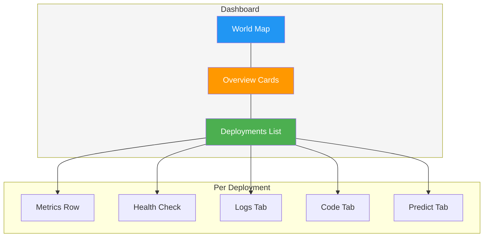

# Monitoring

[Ultralytics Platform](https://platform.ultralytics.com) provides monitoring for deployed endpoints. Track request metrics, view logs, and check health status with automatic polling.


## Deployments Dashboard

The `Deploy` page in the sidebar serves as the monitoring dashboard for all your deployments. It combines the world map, overview metrics, and deployment management in one view. See [Dedicated Endpoints](endpoints.md) for creating and managing deployments.



### Overview Cards

Four summary cards at the top of the page show:


| Metric                   | Description                   |
| ------------------------ | ----------------------------- |
| **Total Requests (24h)** | Requests across all endpoints |
| **Active Deployments**   | Currently running endpoints   |
| **Error Rate (24h)**     | Percentage of failed requests |
| **P95 Latency (24h)**    | 95th percentile response time |

!!! warning "Error Rate Alert"

    The error rate card highlights in red when the rate exceeds 5%. Check the `Logs` tab on individual deployments to diagnose errors.

### World Map

The interactive world map shows:

- **Region pins** for all 43 available regions
- **Green pins** for deployed regions
- **Animated blue pins** for regions with active deployments in progress
- **Pin size** varies based on deployment status and latency


### Deployments List

Below the overview cards, the deployments list shows all endpoints across your projects. Use the view mode toggle to switch between:

| View        | Description                                                                  |
| ----------- | ---------------------------------------------------------------------------- |
| **Cards**   | Full detail cards with metrics, logs, code, and predict tabs                 |
| **Compact** | Grid of smaller cards (1-4 columns) with key metrics                         |
| **Table**   | DataTable with sortable columns: Name, Region, Status, Requests, P95, Errors |

!!! tip "Real-Time Updates"

    The dashboard polls every 30 seconds for metric updates. When deployments are in a transitional state (creating, deploying), polling increases to every 3 seconds. Click the refresh button for immediate updates.

## Per-Deployment Metrics

Each deployment card (in cards view) shows real-time metrics:

### Metrics Row

| Metric          | Description                   |
| --------------- | ----------------------------- |
| **Requests**    | Request count (24h) with icon |
| **P95 Latency** | 95th percentile response time |
| **Error Rate**  | Percentage of failed requests |

Metrics are fetched from the sparkline API endpoint and refresh every 60 seconds.

### Health Check

Running deployments show a health check indicator:

| Indicator         | Meaning                          |
| ----------------- | -------------------------------- |
| **Green heart**   | Healthy — shows response latency |
| **Red heart**     | Unhealthy — shows error message  |
| **Spinning icon** | Health check in progress         |

Health checks auto-retry every 20 seconds when unhealthy. Click the refresh icon to manually trigger a health check. The health check uses a 55-second timeout to accommodate cold starts on scale-to-zero endpoints.


!!! info "Cold Start Tolerance"

    The health check uses a 55-second timeout to account for cold starts on scale-to-zero endpoints (up to ~45 seconds in worst case). Once the endpoint warms up, health checks complete in milliseconds.

## Logs

Each deployment card includes a `Logs` tab for viewing recent log entries:


### Log Entries

Each log entry shows:

| Field         | Description                             |
| ------------- | --------------------------------------- |
| **Severity**  | Color-coded bar (see below)             |
| **Timestamp** | Request time (local format)             |
| **Message**   | Log content                             |
| **HTTP info** | Status code and latency (if applicable) |

=== "Severity Levels"

    Filter logs by severity using the filter buttons:

    | Level        | Color    | Description         |
    | ------------ | -------- | ------------------- |
    | **DEBUG**    | Gray     | Debug messages      |
    | **INFO**     | Blue     | Normal requests     |
    | **WARNING**  | Yellow   | Non-critical issues |
    | **ERROR**    | Red      | Failed requests     |
    | **CRITICAL** | Dark Red | Critical failures   |

=== "Log Controls"

    | Control     | Description                         |
    | ----------- | ----------------------------------- |
    | **Errors**  | Filter to ERROR and WARNING entries |
    | **All**     | Show all log entries                |
    | **Copy**    | Copy all visible logs to clipboard  |
    | **Refresh** | Reload log entries                  |

The UI shows the 20 most recent entries. The API defaults to 50 entries per request (max 200).

!!! tip "Debugging Workflow"

    When investigating errors: first click **Errors** to filter to ERROR and WARNING entries, then review timestamps and HTTP status codes. Copy logs to clipboard for sharing with your team.

## Code Examples

Each deployment card includes a `Code` tab showing ready-to-use API code with your actual endpoint URL and API key:

=== "Python"

    ```python
    import requests

    # Deployment endpoint
    url = "https://predict-abc123.run.app/predict"

    # Headers with your deployment API key
    headers = {"Authorization": "Bearer YOUR_API_KEY"}

    # Inference parameters
    data = {"conf": 0.25, "iou": 0.7, "imgsz": 640}

    # Send image for inference
    with open("image.jpg", "rb") as f:
        response = requests.post(url, headers=headers, data=data, files={"file": f})

    print(response.json())
    ```

=== "JavaScript"

    ```javascript
    // Build form data with image and parameters
    const formData = new FormData();
    formData.append("file", fileInput.files[0]);
    formData.append("conf", "0.25");
    formData.append("iou", "0.7");
    formData.append("imgsz", "640");

    // Send image for inference
    const response = await fetch(
      "https://predict-abc123.run.app/predict",
      {
        method: "POST",
        headers: { Authorization: "Bearer YOUR_API_KEY" },
        body: formData,
      }
    );

    const result = await response.json();
    console.log(result);
    ```

=== "cURL"

    ```bash
    # Send image for inference
    curl -X POST "https://predict-abc123.run.app/predict" \
      -H "Authorization: Bearer YOUR_API_KEY" \
      -F "file=@image.jpg" \
      -F "conf=0.25" \
      -F "iou=0.7" \
      -F "imgsz=640"
    ```

!!! note "Auto-Populated Credentials"

    When viewing the `Code` tab in the platform, your actual endpoint URL and API key are automatically filled in. Copy the code and run it directly. See [API Keys](../account/api-keys.md) to generate a key.

## Deployment Predict

The `Predict` tab on each deployment card provides an inline predict panel — the same interface as the model's `Predict` tab, but running inference through the deployment endpoint instead of the shared service. This is useful for testing a deployed endpoint directly from the browser. See [Inference](inference.md) for parameter details and response formats.

## API Endpoints

### Monitoring Overview

```
GET /api/monitoring
```

Returns aggregated metrics for all deployments owned by the authenticated user. Workspace-aware via optional `owner` query parameter.

### Deployment Metrics

```
GET /api/deployments/{deploymentId}/metrics?sparkline=true&range=24h
```

Returns sparkline data and summary metrics for a specific deployment. Refresh interval: 60 seconds.

| Parameter   | Type   | Description                                   |
| ----------- | ------ | --------------------------------------------- |
| `sparkline` | bool   | Include sparkline data                        |
| `range`     | string | Time range: `1h`, `6h`, `24h`, `7d`, or `30d` |

### Deployment Logs

```
GET /api/deployments/{deploymentId}/logs?limit=50&severity=ERROR,WARNING
```

Returns recent log entries with optional severity filter and pagination.

| Parameter   | Type   | Description                                   |
| ----------- | ------ | --------------------------------------------- |
| `limit`     | int    | Max entries to return (default: 50, max: 200) |
| `severity`  | string | Comma-separated severity filter               |
| `pageToken` | string | Pagination token from previous response       |

### Deployment Health

```
GET /api/deployments/{deploymentId}/health
```

Returns health check status with response latency.

```json
{
    "healthy": true,
    "status": 200,
    "latencyMs": 142
}
```

## Performance Optimization

Use monitoring data to optimize your deployments:

=== "High Latency"

    If latency is too high:

    1. Check instance count (may need more)
    2. Verify model size is appropriate
    3. Consider a closer region
    4. Check image sizes being sent

    !!! example "Reducing Latency"

        Switch from `imgsz=1280` to `imgsz=640` for a ~4x speedup with minimal accuracy loss for most use cases. Deploy to a region closer to your users for lower network latency.

=== "High Error Rate"

    If errors are occurring:

    1. Review error logs in the `Logs` tab
    2. Check request format (multipart form required)
    3. Verify API key is valid
    4. Check rate limits

=== "Scaling Issues"

    If hitting capacity:

    1. Consider multiple regions
    2. Optimize request batching
    3. Increase CPU and memory resources

## FAQ

### How long is data retained?

| Data Type   | Retention |
| ----------- | --------- |
| **Metrics** | 30 days   |
| **Logs**    | 7 days    |

### Can I set up external monitoring?

Yes, endpoint URLs work with external monitoring tools:

- Uptime monitoring (Pingdom, UptimeRobot)
- APM tools (Datadog, New Relic)
- Custom health checks via the `/health` endpoint

### How accurate are the latency numbers?

Latency metrics measure:

- **P50**: Median response time
- **P95**: 95th percentile
- **P99**: 99th percentile

These represent server-side processing time, not including network latency to your users.

### Why are my metrics delayed?

Metrics have a ~2 minute delay due to:

- Metrics aggregation pipeline
- Aggregation windows
- Dashboard caching

For real-time debugging, check logs which are near-instant.

### Can I monitor multiple endpoints together?

Yes, the deployments page shows all endpoints with aggregated overview cards. Use the table view to compare performance across deployments.
