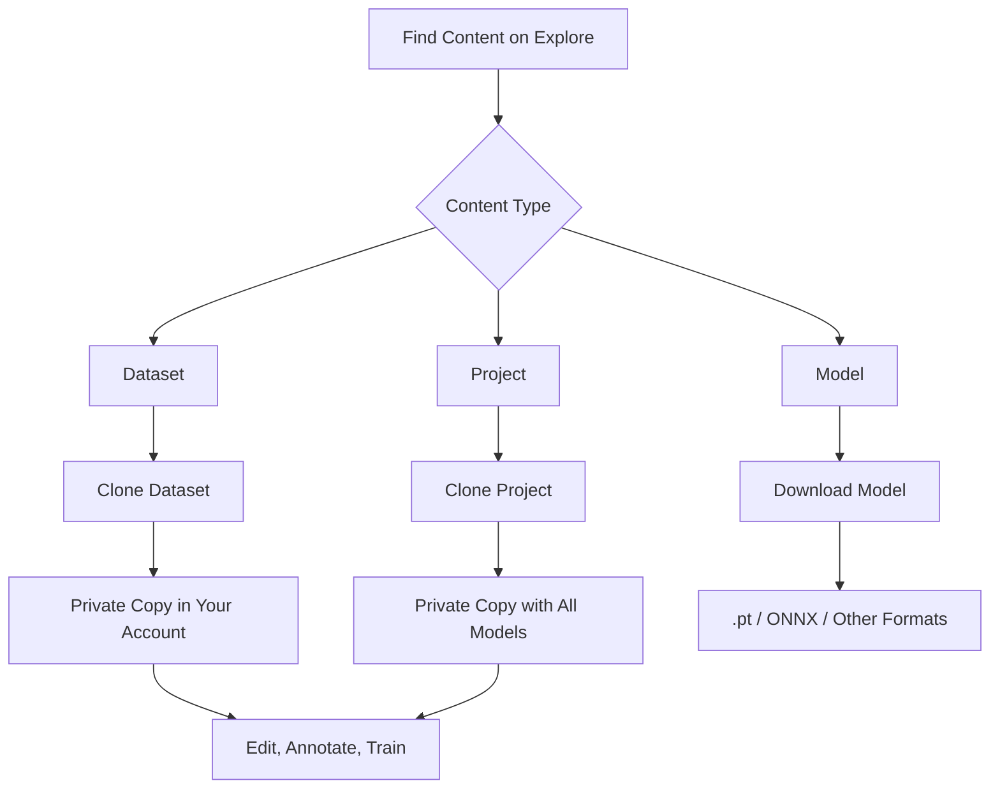
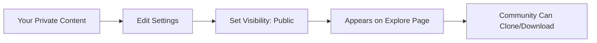

# Explore

[Ultralytics Platform](https://platform.ultralytics.com) Explore page showcases public content from the community. Discover [datasets](data/datasets.md) and [projects](train/projects.md) for inspiration and learning. The Explore page is accessible to everyone — even without signing in.

```mermaid
graph LR
    A[🔍 Browse Explore] --> B[📥 Clone to Account]
    B --> C[✏️ Customize & Annotate]
    C --> D[🚀 Train Model]
    D --> E[🌐 Deploy Endpoint]

    style A fill:#4CAF50,color:#fff
    style B fill:#2196F3,color:#fff
    style C fill:#FF9800,color:#fff
    style D fill:#9C27B0,color:#fff
    style E fill:#E91E63,color:#fff
```




!!! info "Anonymous Access"

    The Explore page works without signing in. Anonymous users see official Ultralytics content in the sidebar under "Ultralytics" instead of "My Projects". To clone content or create your own, you'll need to sign up.

## Overview

The Explore page features two tabs:

- **Public Datasets**: Community training data with image previews
- **Public Projects**: Complete experiments containing trained models

Official Ultralytics content (e.g., `@ultralytics` projects and datasets) is pinned to the top of results.

## Browse Content

### Tabs

The Explore page uses a tabbed interface with `Datasets` and `Projects` tabs. Each tab has its own search, sort, and view mode controls.

| Tab          | Description                                       |
| ------------ | ------------------------------------------------- |
| **Datasets** | Labeled image collections for training (default)  |
| **Projects** | Organized model collections with training results |

### Search and Sort

Each tab provides a search bar and sort options:


| Sort Option       | Description                                   |
| ----------------- | --------------------------------------------- |
| **Most Starred**  | Content with most community stars (default)   |
| **Newest**        | Most recently created                         |
| **Oldest**        | Oldest first                                  |
| **Name A-Z**      | Alphabetical ascending                        |
| **Name Z-A**      | Alphabetical descending                       |
| **Most images**   | Most images (datasets) or models (projects)   |
| **Fewest images** | Fewest images (datasets) or models (projects) |

### View Modes

Toggle between three view modes for browsing:

| Mode        | Description                                      |
| ----------- | ------------------------------------------------ |
| **Cards**   | Grid of preview cards with thumbnails            |
| **Compact** | Smaller cards in a responsive grid (2-3 columns) |
| **Table**   | Sortable table with columns                      |

Cards and compact views support infinite scroll for loading more results.

## Content Cards

Each item displays:


=== "Project Cards"

    | Element              | Description                                                   |
    | -------------------- | ------------------------------------------------------------- |
    | **Icon**             | Project icon with custom colors                               |
    | **Name**             | Project title                                                 |
    | **Creator**          | Author avatar and username                                    |
    | **Description**      | Short project description                                     |
    | **Model Count**      | Number of models in the project                               |
    | **Model Tags**       | Names of models in the project                                |
    | **Visibility Badge** | Public or private indicator (shows lock icon for private)     |
    | **Star Count**       | Number of community stars                                     |

=== "Dataset Cards"

    | Element              | Description                                                   |
    | -------------------- | ------------------------------------------------------------- |
    | **Thumbnails**       | Preview images from the dataset                               |
    | **Name**             | Dataset title                                                 |
    | **Creator**          | Author avatar and username                                    |
    | **Task Badge**       | YOLO task type (detect, segment, etc.)                        |
    | **Image Count**      | Number of images in the dataset                               |
    | **Visibility Badge** | Public or private indicator (shows lock icon for private)     |
    | **Star Count**       | Number of community stars                                     |

## Use Public Content



### Clone Dataset

Use a public dataset for your training:

1. Click on the dataset to open its detail page
2. Click `Clone`
3. Dataset copies to your account

!!! note "Cloned Dataset Properties"

    - Cloned datasets are **private by default**
    - You can modify classes, annotations, and splits
    - Changes don't affect the original dataset
    - Images are deduplicated using content-addressable storage — cloning is fast

See [Datasets](data/datasets.md) for managing and annotating your cloned dataset.

### Download Model

Download a public model:

1. Click on the model within a project
2. Click the **download icon**
3. Select format (PT, ONNX, etc.)

You can also use the model for inference or as a starting point for fine-tuning:

```bash
# Use a downloaded model for inference
yolo predict model=path/to/downloaded-model.pt source=image.jpg

# Fine-tune on your own dataset
yolo train model=path/to/downloaded-model.pt data=my-dataset.yaml epochs=50
```

### Clone Project

Copy a public project to your workspace:

1. Click on the project to open its detail page
2. Click `Clone`
3. Project copies with all models to your account

See [Projects](train/projects.md) for organizing models in your cloned project.

## Official Ultralytics Content

Official `@ultralytics` content is pinned to the top of the Explore page. This includes:

| Project                           | Description                 | Models                       | Tasks                                |
| --------------------------------- | --------------------------- | ---------------------------- | ------------------------------------ |
| **[YOLO26](../models/yolo26.md)** | Latest January 2026 release | 25 models (all sizes, tasks) | detect, segment, pose, OBB, classify |
| **[YOLO11](../models/yolo11.md)** | Current stable release      | 10+ models                   | detect, segment, pose, OBB, classify |
| **YOLOv8**                        | Previous generation         | Various                      | detect, segment, pose, classify      |
| **YOLOv5**                        | Legacy, widely adopted      | Various                      | detect, segment, classify            |

Official datasets include benchmark datasets like [coco8](../datasets/detect/coco8.md) (8-image COCO subset), [VOC](../datasets/detect/voc.md), [african-wildlife](../datasets/detect/african-wildlife.md), [dota8](../datasets/obb/dota8.md), and other commonly used computer vision datasets.

!!! tip "Quick Start with Official Models"

    The fastest way to get started is to clone an official Ultralytics project and use a pretrained model to train on your own dataset:

    1. Go to `Explore` > `Projects` tab
    2. Find the **YOLO26** project from `@ultralytics`
    3. Clone it to your account
    4. Upload your dataset in [supported formats](data/datasets.md#preparing-your-dataset) and start training with a pretrained checkpoint

## User Profiles

Click on a creator's username to view their public profile at `platform.ultralytics.com/{username}`. Public profiles show:


| Section      | Content                      |
| ------------ | ---------------------------- |
| **Bio**      | User description and company |
| **Links**    | Social profiles              |
| **Projects** | Public projects with models  |
| **Datasets** | Public datasets              |

## Make Your Content Public

Make your work available to the community. Public content appears on the Explore page and is visible to everyone, including users who aren't signed in.



### Make Dataset Public

1. Go to your dataset
2. Open the actions menu (three dots)
3. Click `Edit`
4. Set visibility to `Public`
5. Click `Save`

### Make Project Public

1. Go to your project
2. Open the actions menu (three dots)
3. Click `Edit`
4. Set visibility to `Public`
5. Click `Save`

!!! tip "Quality Content"

    Before making content public:

    - Add a clear, descriptive name and description
    - Define class names in the dataset settings
    - Verify data quality and annotation accuracy
    - Test model performance and include training metrics

!!! warning "Public Content Visibility"

    Public content is visible to **everyone on the internet**, including anonymous users. Make sure your dataset doesn't contain sensitive, private, or copyrighted data before making it public. You can change visibility back to private at any time.

## Guidelines

When contributing public content:

### Do

- Provide useful, high-quality content
- Write clear descriptions
- Include relevant metadata
- Respond to questions
- Credit data sources

### Don't

- Upload sensitive/private data
- Violate copyrights
- Upload inappropriate content
- Spam low-quality content
- Misrepresent performance

## Public Content URLs

Public content on the platform uses clean, shareable URLs:

| Content  | URL Pattern                                             | Example                                               |
| -------- | ------------------------------------------------------- | ----------------------------------------------------- |
| Profile  | `platform.ultralytics.com/{username}`                   | `platform.ultralytics.com/ultralytics`                |
| Datasets | `platform.ultralytics.com/{username}/datasets`          | `platform.ultralytics.com/ultralytics/datasets`       |
| Dataset  | `platform.ultralytics.com/{username}/datasets/{slug}`   | `platform.ultralytics.com/ultralytics/datasets/coco`  |
| Project  | `platform.ultralytics.com/{username}/{project}`         | `platform.ultralytics.com/ultralytics/yolo26`         |
| Model    | `platform.ultralytics.com/{username}/{project}/{model}` | `platform.ultralytics.com/ultralytics/yolo26/yolo26n` |

!!! tip "Shareable Links"

    You can share any public content URL directly. Recipients can view the content without signing in. To clone or download, they'll need an account.

## FAQ

### Can I use public content commercially?

Check individual content licenses. Most community content is for:

- Research and education
- Personal projects
- Non-commercial use

Contact creators for commercial licensing.

### How do I report inappropriate content?

1. Click the report button on the content
2. Select violation type
3. Add details
4. Submit report

Our team reviews reports within 24-48 hours.

### Can I make public content private again?

Yes, you can change visibility anytime:

1. Open content settings
2. Change visibility to **Private**
3. Save changes

Existing clones are not affected.

### How do I get featured?

Featured content is selected based on:

- Quality and usefulness
- Community engagement
- Novelty and interest
- Clear documentation

There's no application process - just create great content!

### Can I monetize public content?

Currently, the platform doesn't support monetization. This may be added in future updates.
