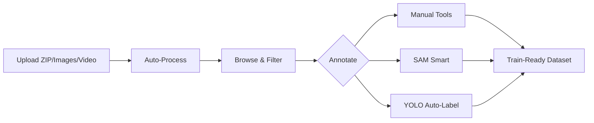
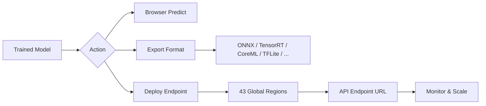

# Ultralytics Platform

<div align="center">
<a href="https://docs.ultralytics.com/zh/platform/">中文</a> |
<a href="https://docs.ultralytics.com/ko/platform/">한국어</a> |
<a href="https://docs.ultralytics.com/ja/platform/">日本語</a> |
<a href="https://docs.ultralytics.com/ru/platform/">Русский</a> |
<a href="https://docs.ultralytics.com/de/platform/">Deutsch</a> |
<a href="https://docs.ultralytics.com/fr/platform/">Français</a> |
<a href="https://docs.ultralytics.com/es/platform/">Español</a> |
<a href="https://docs.ultralytics.com/pt/platform/">Português</a> |
<a href="https://docs.ultralytics.com/tr/platform/">Türkçe</a> |
<a href="https://docs.ultralytics.com/vi/platform/">Tiếng Việt</a> |
<a href="https://docs.ultralytics.com/ar/platform/">العربية</a>
<br>
<br>

<a href="https://discord.com/invite/ultralytics"></a> <a href="https://community.ultralytics.com/"></a> <a href="https://www.reddit.com/r/ultralytics/"></a>

</div>

[Ultralytics Platform](https://platform.ultralytics.com) is a comprehensive end-to-end computer vision platform that streamlines the entire ML workflow from data preparation to model deployment. Built for teams and individuals who need production-ready [computer vision](https://www.ultralytics.com/glossary/computer-vision-cv) solutions without the infrastructure complexity.


## What is Ultralytics Platform?

Ultralytics Platform is designed to replace fragmented ML tooling with a unified solution. It combines the capabilities of:

- **Roboflow** - Data management and annotation
- **Weights & Biases** - Experiment tracking
- **SageMaker** - Cloud training
- **HuggingFace** - Model deployment
- **Arize** - Monitoring

All in one platform with native support for [YOLO26](../models/yolo26.md) and [YOLO11](../models/yolo11.md) models.

## Workflow: Upload → Annotate → Train → Export → Deploy

The Platform provides an end-to-end workflow:

```mermaid
graph LR
    subgraph Data["📁 Data"]
        A[Upload] --> B[Annotate]
        B --> C[Analyze]
    end
    subgraph Train["🚀 Train"]
        D[Configure] --> E[Train on GPU]
        E --> F[View Metrics]
    end
    subgraph Deploy["🌐 Deploy"]
        G[Export] --> H[Deploy Endpoint]
        H --> I[Monitor]
    end
    Data --> Train --> Deploy
```



| Stage        | Features                                                                                                                                       |
| ------------ | ---------------------------------------------------------------------------------------------------------------------------------------------- |
| **Upload**   | Images (50MB), videos (1GB), ZIP archives (10GB) with automatic processing                                                                     |
| **Annotate** | Manual tools, SAM smart annotation, YOLO auto-labeling for all 5 task types (see [supported tasks](data/index.md#supported-tasks))             |
| **Train**    | Cloud GPUs (22 options from RTX 2000 Ada to B200), real-time metrics, project organization                                                     |
| **Export**   | [17 deployment formats](../modes/export.md) (ONNX, TensorRT, CoreML, TFLite, etc.; see [supported formats](train/models.md#supported-formats)) |
| **Deploy**   | 43 global regions with dedicated endpoints, auto-scaling, monitoring                                                                           |

**What you can do:**

- **Upload** images, videos, and ZIP archives to create training datasets
- **Visualize** annotations with interactive overlays for all 5 YOLO task types (see [supported tasks](data/index.md#supported-tasks))
- **Train** models on 22 cloud GPU types with real-time metrics
- **Export** to [17 deployment formats](../modes/export.md) (ONNX, TensorRT, CoreML, TFLite, etc.)
- **Deploy** to 43 global regions with one-click dedicated endpoints
- **Monitor** training progress, deployment health, and usage metrics
- **Collaborate** by making projects and datasets public for the community

## Multi-Region Infrastructure

Your data stays in your region. Ultralytics Platform operates infrastructure in three global regions:

| Region | Label                        | Location                | Best For                                |
| ------ | ---------------------------- | ----------------------- | --------------------------------------- |
| **US** | Americas                     | Iowa, USA               | Americas users, fastest for Americas    |
| **EU** | Europe, Middle East & Africa | Belgium, Europe         | European users, GDPR compliance         |
| **AP** | Asia Pacific                 | Hong Kong, Asia-Pacific | Asia-Pacific users, lowest APAC latency |

You select your region during onboarding, and all your data, models, and deployments remain in that region.

!!! warning "Region is Permanent"

    Your data region cannot be changed after account creation. During onboarding, the platform measures latency to each region and recommends the closest one. Choose carefully.

## Key Features

### Data Preparation

- **Dataset Management**: Upload images, videos, or ZIP archives with automatic processing
- **Annotation Editor**: Manual annotation for all 5 YOLO task types (detect, segment, pose, OBB, classify; see [supported tasks](data/index.md#supported-tasks))
- **SAM Smart Annotation**: Click-based intelligent annotation using [Segment Anything Model](../models/sam.md)
- **Auto-Annotation**: Use trained models to pre-label new data
- **Statistics**: Class distribution, location heatmaps, and dimension analysis



!!! tip "Supported Task Types"

    The annotation editor supports all 5 YOLO task types: **[detect](../datasets/detect/index.md)** (bounding boxes), **[segment](../datasets/segment/index.md)** (polygons), **[pose](../datasets/pose/index.md)** (keypoints), **[OBB](../datasets/obb/index.md)** (oriented boxes), and **[classify](../datasets/classify/index.md)** (image-level labels). Each task type has dedicated drawing tools and keyboard shortcuts.

### Model Training

- **Cloud Training**: Train on 22 cloud GPU types with real-time metrics
- **Remote Training**: Train anywhere and stream metrics to the platform (W&B-style)
- **Project Organization**: Group related models, compare experiments, track activity
- **17 Export Formats**: ONNX, TensorRT, CoreML, TFLite, and more (see [supported formats](train/models.md#supported-formats))


You can train models either through the web UI (cloud training) or from your own machine (remote training):

=== "Cloud Training (Web UI)"

    1. Navigate to your project
    2. Click `Train Model`
    3. Select dataset, model, GPU, and epochs
    4. Monitor real-time loss curves and metrics

=== "Remote Training (CLI)"

    ```bash
    # Install ultralytics
    pip install "ultralytics>=8.4.14"

    # Set your API key
    export ULTRALYTICS_API_KEY="your_api_key"

    # Train and stream metrics to the platform
    yolo train model=yolo26n.pt data=coco.yaml epochs=100 project=username/my-project name=exp1
    ```

=== "Remote Training (Python)"

    ```python
    import os

    from ultralytics import YOLO

    os.environ["ULTRALYTICS_API_KEY"] = "your_api_key"

    model = YOLO("yolo26n.pt")
    model.train(
        data="coco.yaml",
        epochs=100,
        project="username/my-project",
        name="exp1",
    )
    # Metrics stream to Platform automatically
    ```

### Deployment

- **Inference Testing**: Test models directly in the browser with custom images
- **Dedicated Endpoints**: Deploy to 43 global regions with auto-scaling
- **Monitoring**: Real-time metrics, request logs, and performance dashboards



Once deployed, call your endpoint from any language:

=== "Python"

    ```python
    import requests

    url = "https://your-endpoint-url/predict"
    headers = {"Authorization": "Bearer your_api_key"}

    with open("image.jpg", "rb") as f:
        response = requests.post(url, headers=headers, files={"file": f})

    print(response.json())
    ```

=== "cURL"

    ```bash
    curl -X POST "https://your-endpoint-url/predict" \
      -H "Authorization: Bearer your_api_key" \
      -F "file=@image.jpg"
    ```

=== "JavaScript"

    ```javascript
    const form = new FormData();
    form.append("file", fileInput.files[0]);

    const response = await fetch("https://your-endpoint-url/predict", {
        method: "POST",
        headers: { Authorization: "Bearer your_api_key" },
        body: form,
    });

    const results = await response.json();
    console.log(results);
    ```

### Account Management

- **Teams & Organizations**: Collaborate with team members, manage roles and invites
- **API Keys**: Secure key management for remote training and API access
- **Credits & Billing**: Pay-as-you-go training with transparent pricing
- **Activity Feed**: Track all account events and actions
- **Trash & Restore**: 30-day soft delete with item recovery
- **GDPR Compliance**: Data export and account deletion

!!! info "Plan Tiers"

    | Feature              | Free           | Pro ($29/mo)        | Enterprise     |
    | -------------------- | -------------- | ------------------- | -------------- |
    | Signup Credit        | $5 / $25*      | -                   | Custom         |
    | Monthly Credit       | -              | $30/seat/month      | Custom         |
    | Models               | 100            | 500                 | Unlimited      |
    | Concurrent Trainings | 3              | 10                  | Unlimited      |
    | Deployments          | 3              | 10 (warm-start)     | Unlimited      |
    | Storage              | 100 GB         | 500 GB              | Unlimited      |
    | Teams                | -              | Up to 5 members     | Up to 50       |
    | Support              | Community      | Priority            | Dedicated      |

    *$5 at signup, or $25 with a verified company/work email.

## Quick Links

Get started with these resources:

- [**Quickstart**](quickstart.md): Create your first project and train a model in minutes
- [**Datasets**](data/datasets.md): Upload and manage your training data
- [**Annotation**](data/annotation.md): Label your data with manual and AI-assisted tools
- [**Projects**](train/projects.md): Organize your models and experiments
- [**Cloud Training**](train/cloud-training.md): Train on cloud GPUs
- [**Inference**](deploy/inference.md): Test your models
- [**Endpoints**](deploy/endpoints.md): Deploy models to production
- [**Monitoring**](deploy/monitoring.md): Track deployment performance
- [**API Keys**](account/api-keys.md): Manage API access
- [**Billing**](account/billing.md): Credits and payment
- [**Activity**](account/activity.md): Track account events
- [**Trash**](account/trash.md): Recover deleted items
- [**REST API**](api/index.md): API reference

## FAQ

### How do I get started with Ultralytics Platform?

To get started with [Ultralytics Platform](https://platform.ultralytics.com):

1. **Sign Up**: Create an account at [platform.ultralytics.com](https://platform.ultralytics.com)
2. **Select Region**: Choose your data region (US, EU, or AP) during onboarding
3. **Upload Dataset**: Navigate to the [Datasets](data/datasets.md) section to upload your data
4. **Train Model**: Create a project and start training on cloud GPUs
5. **Deploy**: Test your model and deploy to a dedicated endpoint

For a detailed guide, see the [Quickstart](quickstart.md) page.

### What are the benefits of Ultralytics Platform?

[Ultralytics Platform](https://platform.ultralytics.com) offers:

- **Unified Workflow**: Data, training, and deployment in one place
- **Multi-Region**: Data residency in US, EU, or AP regions
- **No-Code Training**: Train advanced YOLO models without writing code
- **Real-Time Metrics**: Stream training progress and monitor deployments
- **43 Deploy Regions**: Deploy models close to your users worldwide
- **5 Task Types**: Support for detection, segmentation, pose, OBB, and classification (see [task docs](../tasks/index.md))
- **AI-Assisted Annotation**: SAM and auto-labeling to speed up data preparation

### What GPU options are available for cloud training?

Ultralytics Platform supports multiple GPU types for cloud training:

| GPU          | VRAM   | Cost/Hour | Best For                |
| ------------ | ------ | --------- | ----------------------- |
| RTX 2000 Ada | 16 GB  | $0.24     | Small datasets, testing |
| RTX A4500    | 20 GB  | $0.24     | Small-medium datasets   |
| RTX A5000    | 24 GB  | $0.26     | Medium datasets         |
| RTX 4000 Ada | 20 GB  | $0.38     | Medium datasets         |
| L4           | 24 GB  | $0.39     | Inference optimized     |
| A40          | 48 GB  | $0.40     | Larger batch sizes      |
| RTX 3090     | 24 GB  | $0.46     | General training        |
| RTX A6000    | 48 GB  | $0.49     | Large models            |
| RTX 4090     | 24 GB  | $0.59     | Great price/performance |
| RTX 6000 Ada | 48 GB  | $0.77     | Large batch training    |
| L40S         | 48 GB  | $0.86     | Large batch training    |
| RTX 5090     | 32 GB  | $0.89     | Latest generation       |
| L40          | 48 GB  | $0.99     | Large models            |
| A100 PCIe    | 80 GB  | $1.39     | Production training     |
| A100 SXM     | 80 GB  | $1.49     | Production training     |
| RTX PRO 6000 | 96 GB  | $1.89     | Recommended default     |
| H100 PCIe    | 80 GB  | $2.39     | Fastest training        |
| H100 SXM     | 80 GB  | $2.69     | Fastest training        |
| H100 NVL     | 94 GB  | $3.07     | High-memory training    |
| H200 NVL     | 143 GB | $3.39     | Maximum memory          |
| H200 SXM     | 141 GB | $3.59     | Maximum performance     |
| B200         | 180 GB | $4.99     | Largest models          |

See [Cloud Training](train/cloud-training.md) for complete pricing and GPU options.

### How does remote training work?

You can train models on your own hardware and stream real-time metrics to the platform, similar to Weights & Biases.

!!! warning "Package Version Requirement"

    Platform integration requires **ultralytics>=8.4.14**. Lower versions will NOT work with Platform.

    ```bash
    pip install "ultralytics>=8.4.14"
    ```

=== "CLI"

    ```bash
    # Set your API key
    export ULTRALYTICS_API_KEY="your_api_key"

    # Train with project/name to stream metrics
    yolo train model=yolo26n.pt data=coco.yaml epochs=100 project=username/my-project name=exp1
    ```

=== "Python"

    ```python
    import os

    from ultralytics import YOLO

    os.environ["ULTRALYTICS_API_KEY"] = "your_api_key"

    model = YOLO("yolo26n.pt")
    model.train(
        data="coco.yaml",
        epochs=100,
        project="username/my-project",
        name="exp1",
    )
    ```

=== "Platform Dataset (ul:// URI)"

    ```bash
    # Train using a Platform dataset directly
    export ULTRALYTICS_API_KEY="your_api_key"

    yolo train model=yolo26n.pt data=ul://username/datasets/my-dataset epochs=100 project=username/my-project name=exp1
    ```

See [Cloud Training](train/cloud-training.md#remote-training) for more details on remote training.

### What annotation tools are available?

The Platform includes a full-featured annotation editor supporting:

- **Manual Tools**: Bounding boxes, polygons, keypoints, oriented boxes, classification
- **SAM Smart Annotation**: Click to generate precise masks using [Segment Anything Model](../models/sam.md)
- **Keyboard Shortcuts**: Efficient workflows with hotkeys

| Shortcut  | Action                     |
| --------- | -------------------------- |
| `V`       | Select mode                |
| `S`       | SAM smart annotation mode  |
| `A`       | Auto-annotate mode         |
| `1` - `9` | Select class by number     |
| `Delete`  | Delete selected annotation |
| `Ctrl+Z`  | Undo                       |
| `Ctrl+Y`  | Redo                       |
| `Escape`  | Cancel current action      |

See [Annotation](data/annotation.md) for the complete guide.

### What export formats are supported?

The Platform supports 17 deployment formats:

| Format        | File Extension      | Use Case                  |
| ------------- | ------------------- | ------------------------- |
| ONNX          | `.onnx`             | Cross-platform deployment |
| TorchScript   | `.torchscript`      | C++ deployment            |
| OpenVINO      | `_openvino_model`   | Intel hardware            |
| TensorRT      | `.engine`           | NVIDIA GPU inference      |
| CoreML        | `.mlpackage`        | Apple devices             |
| TFLite        | `.tflite`           | Mobile/edge devices       |
| TF SavedModel | `_saved_model`      | TensorFlow ecosystem      |
| TF GraphDef   | `.pb`               | TensorFlow legacy         |
| PaddlePaddle  | `_paddle_model`     | Baidu ecosystem           |
| NCNN          | `_ncnn_model`       | Mobile (Android/ARM)      |
| Edge TPU      | `_edgetpu.tflite`   | Google Coral devices      |
| TF.js         | `_web_model`        | Browser deployment        |
| MNN           | `.mnn`              | Alibaba mobile            |
| RKNN          | `_rknn_model`       | Rockchip NPU              |
| IMX500        | `_imx_model`        | Sony IMX500 sensor        |
| Axelera       | `_axelera_model`    | Axelera AI accelerators   |
| ExecuTorch    | `_executorch_model` | PyTorch mobile            |

See [Models Export](train/models.md#export-model), the [Export mode guide](../modes/export.md), and the [Integrations index](../integrations/index.md) for format-specific options.

## Troubleshooting

### Dataset Issues

| Problem                | Solution                                                                                                                                                  |
| ---------------------- | --------------------------------------------------------------------------------------------------------------------------------------------------------- |
| Dataset won't process  | Check file format is supported (JPEG, PNG, WebP, etc.). Max file size: images 50MB, videos 1GB, ZIP 10GB                                                  |
| Missing annotations    | Verify labels are in [YOLO format](../datasets/detect/index.md#ultralytics-yolo-format) with `.txt` files matching image filenames                        |
| "Train split required" | Add `train/` folder to your dataset structure, or create splits in [dataset settings](data/datasets.md#filter-by-split)                                   |
| Class names undefined  | Add a `data.yaml` file with `names:` list (see [YOLO format](../datasets/detect/index.md#ultralytics-yolo-format)), or define classes in dataset settings |

### Training Issues

| Problem              | Solution                                                                            |
| -------------------- | ----------------------------------------------------------------------------------- |
| Training won't start | Check credit balance in Settings > Billing. Positive balance required               |
| Out of memory error  | Reduce batch size, use smaller model (n/s), or select GPU with more VRAM            |
| Poor metrics         | Check dataset quality, increase epochs, try data augmentation, verify class balance |
| Training slow        | Select faster GPU, reduce image size, check dataset isn't bottlenecked              |

### Deployment Issues

| Problem                 | Solution                                                                                                                    |
| ----------------------- | --------------------------------------------------------------------------------------------------------------------------- |
| Endpoint not responding | Check endpoint status (Ready vs Stopped). Cold start may take 5-15 seconds                                                  |
| 401 Unauthorized        | Verify API key is correct and has required scopes                                                                           |
| Slow inference          | Check model size, consider [TensorRT export](train/models.md#supported-formats), select closer region                       |
| Export failed           | Some formats require specific model architectures. Try [ONNX](train/models.md#supported-formats) for broadest compatibility |

### Common Questions

??? question "Can I change my username after signup?"

    No, usernames are permanent and cannot be changed. Choose carefully during signup.

??? question "Can I change my data region?"

    No, data region is selected during signup and cannot be changed. To switch regions, create a new account and re-upload your data.

??? question "How do I get more credits?"

    Go to Settings > Billing > Add Credits. Purchase credits from $5 to $1000. Purchased credits never expire.

??? question "What happens if training fails?"

    You're only charged for completed compute time. Checkpoints are saved, and you can resume training.

??? question "Can I download my trained model?"

    Yes, click the download icon on any model page to download the `.pt` file or exported formats.

??? question "How do I share my work publicly?"

    Edit your project or dataset settings and toggle visibility to "Public". Public content appears on the Explore page.

??? question "What are the file size limits?"

    Images: 50MB, Videos: 1GB, ZIP archives: 10GB. For larger files, split into multiple uploads.

??? question "How long are deleted items kept in Trash?"

    30 days. After that, items are permanently deleted and cannot be recovered.

??? question "Can I use Platform models commercially?"

    Free and Pro plans use AGPL license. For commercial use without AGPL requirements, contact sales@ultralytics.com for Enterprise licensing.
