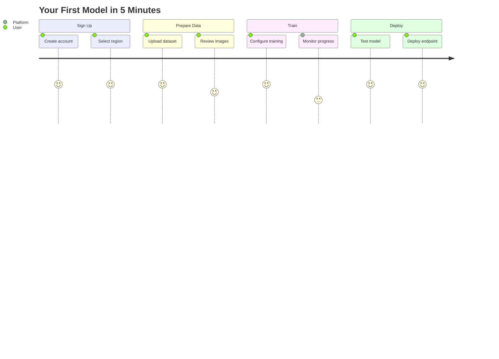
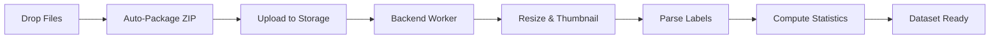
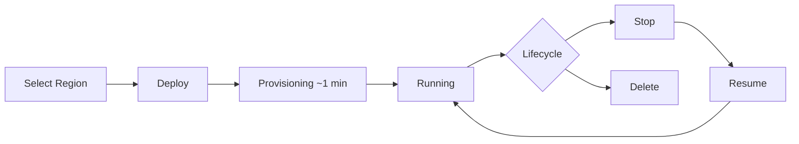

# Ultralytics Platform Quickstart

[Ultralytics Platform](https://platform.ultralytics.com) is designed to be user-friendly and intuitive, allowing users to quickly upload their datasets and train new YOLO models. It offers a range of pretrained models to choose from, making it easy for users to get started. Once a model is trained, it can be tested directly in the browser and deployed to production with a single click.



## Get Started

[Ultralytics Platform](https://platform.ultralytics.com) offers a variety of easy signup options. You can register and log in using your Google or GitHub accounts, or with your email address.


### Region Selection

During onboarding, you'll be asked to select your data region. The Platform automatically measures latency to each region and recommends the closest one. This is an important choice as it determines where your data, models, and deployments will be stored.


| Region | Label                        | Location                | Best For                                |
| ------ | ---------------------------- | ----------------------- | --------------------------------------- |
| **US** | Americas                     | Iowa, USA               | Americas users, fastest for Americas    |
| **EU** | Europe, Middle East & Africa | Belgium, Europe         | European users, GDPR compliance         |
| **AP** | Asia Pacific                 | Hong Kong, Asia-Pacific | Asia-Pacific users, lowest APAC latency |

!!! warning "Region is Permanent"

    Your region selection cannot be changed after account creation. Choose the region closest to you or your users for best performance.

### Free Credits

Every new account receives free credits for cloud GPU training:

| Email Type             | Sign-up Credits | How to Qualify                         |
| ---------------------- | --------------- | -------------------------------------- |
| **Work/Company Email** | **$25.00**      | Use your company domain (@company.com) |
| **Personal Email**     | **$5.00**       | Gmail, Yahoo, Outlook, etc.            |

!!! tip "Maximize Your Credits"

    Sign up with a work email to receive $25 in credits. If you signed up with a personal email, you can verify a work email later to unlock the additional $20 in credits.

### Complete Your Profile

Before selecting your region, you'll complete your profile with a display name, username, optional company, and primary use case. The onboarding flow has three steps: Profile, Data Region, and Complete.


??? tip "Update Later"

    You can update your profile anytime from the Settings page, including your display name, bio, and social links. Note that your username cannot be changed after signup.

## Home Dashboard

After signing in, you will be directed to the Home page of [Ultralytics Platform](https://platform.ultralytics.com), which provides a welcome card with workspace stats, quick access to datasets, projects, and storage, and a recent activity feed.


### Sidebar Navigation

The sidebar provides access to all Platform sections:

| Section         | Item     | Description                                      |
| --------------- | -------- | ------------------------------------------------ |
| **Top**         | Search   | Quick search across all your resources (Cmd+K)   |
|                 | Home     | Dashboard with quick actions and recent activity |
|                 | Explore  | Discover public projects and datasets            |
| **My Projects** | Annotate | Your datasets organized for annotation           |
|                 | Train    | Your projects containing trained models          |
|                 | Deploy   | Your active deployments                          |
| **Bottom**      | Trash    | Deleted items (recoverable for 30 days)          |
|                 | Settings | Account, billing, and preferences                |
|                 | Feedback | Send feedback to Ultralytics                     |

### Welcome Card

The welcome card shows your profile, plan badge, and workspace statistics at a glance:

| Stat            | Description                      |
| --------------- | -------------------------------- |
| **Datasets**    | Number of datasets               |
| **Images**      | Total images across all datasets |
| **Annotations** | Total annotation count           |
| **Projects**    | Number of projects               |
| **Models**      | Total trained models             |
| **Exports**     | Number of model exports          |
| **Deployments** | Active deployment count          |

### Quick Actions

Below the welcome card, the dashboard shows three cards:

- **Datasets**: Create a new dataset or drop images, videos, or ZIP files to upload. Shows your recent datasets.
- **Projects**: Create a new project or drop `.pt` model files to upload. Shows your recent projects.
- **Storage**: Overview of your storage usage (datasets, models, exports) with plan limits.

A **Recent Activity** table at the bottom shows your latest datasets, models, and training runs.

## Upload Your First Dataset

Navigate to `Annotate` in the sidebar and click `New Dataset` to add your training data. You can also drag and drop files directly onto the Datasets card on the Home dashboard.


Ultralytics Platform supports multiple upload formats (full details in [Datasets](data/datasets.md)):

| Format                                                                 | Max Size | Description                                            |
| ---------------------------------------------------------------------- | -------- | ------------------------------------------------------ |
| **Images**                                                             | 50 MB    | JPG, PNG, WebP, TIFF, and other common formats         |
| **ZIP Archive**                                                        | 10 GB    | Compressed folder with images and labels               |
| **Video**                                                              | 1 GB     | MP4, AVI - frames extracted at ~1 fps (max 100 frames) |
| **[YOLO Format](../datasets/detect/index.md#ultralytics-yolo-format)** | 10 GB    | Standard YOLO dataset structure with labels            |



After upload, the platform automatically processes your data:

1. Images larger than 4096px are resized (preserving aspect ratio)
2. 256px thumbnails are generated for fast browsing
3. Labels are parsed and validated ([YOLO `.txt` format](../datasets/detect/index.md#ultralytics-yolo-format))
4. Statistics are computed (class distribution, heatmaps, dimensions)

!!! tip "YOLO Dataset Structure"

    For best results, upload a ZIP with the standard YOLO structure:

    ```
    my-dataset.zip
    ├── data.yaml          # Class names and splits
    ├── train/
    │   ├── images/
    │   │   ├── img001.jpg
    │   │   └── img002.jpg
    │   └── labels/
    │       ├── img001.txt
    │       └── img002.txt
    └── val/
        ├── images/
        └── labels/
    ```

    For full syntax across tasks, see [detect](../datasets/detect/index.md#ultralytics-yolo-format), [segment](../datasets/segment/index.md#ultralytics-yolo-format), [pose](../datasets/pose/index.md#ultralytics-yolo-format), [OBB](../datasets/obb/index.md#yolo-obb-format), and [classify](../datasets/classify/index.md#dataset-structure-for-yolo-classification-tasks) dataset guides.

Read more about [datasets](data/datasets.md) and supported formats for [detect](../datasets/detect/index.md), [segment](../datasets/segment/index.md), [pose](../datasets/pose/index.md), [OBB](../datasets/obb/index.md), and [classify](../datasets/classify/index.md).

## Create Your First Project

Projects help you organize related models and experiments. Navigate to Projects and click "Create Project".


Enter a name and optional description for your project. Projects contain:

- **Models**: Trained checkpoints
- **Activity Log**: History of changes

Read more about [projects](train/projects.md).

## Train Your First Model

From your project, click `Train Model` to start cloud training.


### Training Configuration

1. **Select Dataset**: Choose from your uploaded datasets (only datasets with a [`train` split](data/datasets.md#filter-by-split) are shown)
2. **Choose Model**: Select a base model — official Ultralytics models or your own trained models
3. **Set Epochs**: Number of training iterations (default: 100)
4. **Select GPU**: Choose compute resources based on your budget and model size

| Model   | Size        | Speed    | Accuracy | Recommended GPU      |
| ------- | ----------- | -------- | -------- | -------------------- |
| YOLO26n | Nano        | Fastest  | Good     | RTX PRO 6000 (96 GB) |
| YOLO26s | Small       | Fast     | Better   | RTX PRO 6000 (96 GB) |
| YOLO26m | Medium      | Moderate | High     | RTX PRO 6000 (96 GB) |
| YOLO26l | Large       | Slower   | Higher   | A100 (80 GB)         |
| YOLO26x | Extra Large | Slowest  | Best     | H100 (80 GB)         |

!!! info "GPU Selection"

    GPUs range from $0.24/hr (RTX 2000 Ada, 16 GB) to $4.99/hr (B200, 180 GB). The default GPU is **RTX PRO 6000** (96 GB Blackwell, $1.89/hr) — a great balance of memory and performance. See the full [GPU pricing table](index.md#what-gpu-options-are-available-for-cloud-training) for all 22 options.

!!! warning "Credit Balance Required"

    Cloud training requires a positive credit balance sufficient to cover the estimated job cost. Check your balance in [`Settings > Billing`](account/billing.md). New accounts receive free credits ($5 for personal email, $25 for work email).

### Monitor Training

Once training starts, you can monitor progress in real-time through three subtabs:

| Subtab      | Content                                                 |
| ----------- | ------------------------------------------------------- |
| **Charts**  | Training/validation loss curves, mAP, precision, recall |
| **Console** | Live training log output                                |
| **System**  | GPU utilization, memory usage, hardware metrics         |


Metrics are streamed in real-time via SSE (Server-Sent Events). After training completes, validation plots are generated including confusion matrix, PR curves, and F1 curves.

!!! tip "Cancel Training"

    You can cancel a running training job at any time. You're only charged for the compute time used up to that point.

Read more about [cloud training](train/cloud-training.md).

## Test Your Model

After training completes, test your model directly in the browser:

1. Navigate to your model's `Predict` tab
2. Upload an image, drag and drop, or use example images (auto-inference on drop)
3. View inference results with bounding boxes rendered on canvas


Adjust inference parameters:

| Parameter      | Default | Description                       |
| -------------- | ------- | --------------------------------- |
| **Confidence** | 0.25    | Filter low-confidence predictions |
| **IoU**        | 0.7     | Control overlap for NMS           |
| **Image Size** | 640     | Resize input for inference        |

The `Predict` tab provides ready-to-use code examples with your actual API key pre-filled:

=== "Python"

    ```python
    import requests

    url = "https://platform.ultralytics.com/api/models/{model_id}/predict"
    headers = {"Authorization": "Bearer your_api_key"}

    with open("image.jpg", "rb") as f:
        response = requests.post(url, headers=headers, files={"file": f})

    print(response.json())
    ```

=== "cURL"

    ```bash
    curl -X POST "https://platform.ultralytics.com/api/models/{model_id}/predict" \
      -H "Authorization: Bearer your_api_key" \
      -F "file=@image.jpg"
    ```

!!! tip "Auto-Inference"

    The Predict tab runs inference automatically when you drop an image — no need to click a button. Example images (bus.jpg, zidane.jpg) are preloaded for instant testing.

Read more about [inference](deploy/inference.md).

## Deploy to Production

Deploy your model to a dedicated endpoint for production use:

1. Navigate to your model's `Deploy` tab
2. Select a region from the interactive world map (43 available regions)
3. The map shows real-time latency measurements with traffic light colors (green < 100ms, yellow < 200ms, red > 200ms)
4. Click `Deploy` to create your endpoint




Your endpoint will be ready in about a minute with:

- **Unique URL**: HTTPS endpoint for API calls
- **Auto-Scaling**: Scales with traffic automatically
- **Monitoring**: Request metrics and logs

!!! info "Deployment Lifecycle"

    Endpoints can be **started**, **stopped**, and **deleted**. Stopped endpoints don't incur compute costs but retain their configuration. Restart a stopped endpoint with one click.

After deployment, you can manage all your endpoints from the `Deploy` section in the sidebar, which shows a global map with active deployments, overview metrics, and a list of all endpoints.

Read more about [endpoints](deploy/endpoints.md).

## Remote Training (Optional)

If you prefer to train on your own hardware, you can stream metrics to the platform using your API key. This works like Weights & Biases — train anywhere, monitor on the platform.

1. Generate an API key in [`Settings > Profile`](account/api-keys.md) (API Keys section)
2. Set the environment variable and train with a `project/name` format:

```bash
export ULTRALYTICS_API_KEY="ul_your_api_key_here"

yolo train model=yolo26n.pt data=coco.yaml epochs=100 project=username/my-project name=exp1
```

!!! note "API Key Format"

    API keys start with `ul_` followed by 40 hex characters (43 characters total). Keys are full-access tokens scoped to your workspace.

Read more about [API keys](account/api-keys.md), [dataset URIs](data/datasets.md#dataset-uri), and [remote training](train/cloud-training.md#remote-training).

## Feedback

We value your feedback! Use the feedback button to help us improve the platform.

??? info "Feedback Privacy"

    Your feedback is private and only visible to the Ultralytics team. We use it to prioritize features and fix issues.

## Need Help?

If you encounter any issues or have questions:

- **Documentation**: Browse these docs for detailed guides
- **Discord**: Join our [Discord community](https://discord.com/invite/ultralytics) for discussions
- **GitHub**: Report issues on [GitHub](https://github.com/ultralytics/ultralytics/issues)

!!! note

    When reporting a bug, please include your browser and operating system details to help us diagnose the issue.
