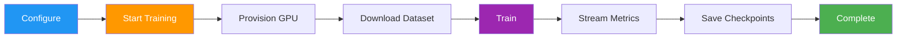
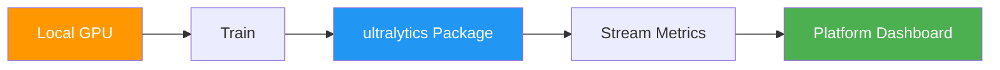
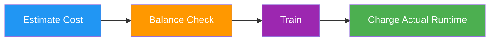

# Cloud Training

[Ultralytics Platform](https://platform.ultralytics.com) Cloud Training offers single-click training on cloud GPUs, making model training accessible without complex setup. Train YOLO models with real-time metrics streaming and automatic checkpoint saving.



## Training Dialog

Start training from the platform UI by clicking **New Model** on any project page (or **Train** from a dataset page). The training dialog has two tabs: **Cloud Training** and **Local Training**.


### Step 1: Select Base Model

Choose from official YOLO26 models or your own trained models:

| Category        | Description                              |
| --------------- | ---------------------------------------- |
| **Official**    | All 25 YOLO26 models (5 sizes x 5 tasks) |
| **Your Models** | Your completed models for fine-tuning    |

Official models are organized by task type ([Detect](../../tasks/detect.md), [Segment](../../tasks/segment.md), [Pose](../../tasks/pose.md), [OBB](../../tasks/obb.md), [Classify](../../tasks/classify.md)) with sizes from nano to xlarge.

### Step 2: Select Dataset

Choose a dataset to train on (see [Datasets](../data/datasets.md)):

| Option            | Description                       |
| ----------------- | --------------------------------- |
| **Official**      | Curated datasets from Ultralytics |
| **Your Datasets** | Datasets you've uploaded          |

!!! note "Dataset Requirements"

    Datasets must be in `ready` status with at least 1 image in the train split, 1 image in the validation or test split, and at least 1 labeled image.

!!! warning "Task Mismatch"

    A task mismatch warning appears if the model task (e.g., detect) doesn't match the dataset task (e.g., segment). Training will fail if you proceed with mismatched tasks. Ensure both model and dataset use the same task type, as described in the [task guides](../../tasks/index.md).

### Step 3: Configure Parameters

Set core training parameters:

| Parameter      | Description                                                                 | Default |
| -------------- | --------------------------------------------------------------------------- | ------- |
| **Epochs**     | Number of training iterations                                               | 100     |
| **Batch Size** | Samples per iteration                                                       | 16      |
| **Image Size** | Input resolution (320/416/512/640/1280 dropdown, or 32-4096 in YAML editor) | 640     |
| **Run Name**   | Optional name for the training run                                          | auto    |

### Step 4: Advanced Settings (Optional)

Expand **Advanced Settings** to access the full YAML-based parameter editor with 40+ training parameters organized by group (see [configuration reference](../../usage/cfg.md)):

| Group                   | Parameters                                                                       |
| ----------------------- | -------------------------------------------------------------------------------- |
| **Learning Rate**       | lr0, lrf, momentum, weight_decay, warmup_epochs, warmup_momentum, warmup_bias_lr |
| **Optimizer**           | SGD, MuSGD, Adam, AdamW, NAdam, RAdam, RMSProp, Adamax                           |
| **Loss Weights**        | box, cls, dfl, pose, kobj, label_smoothing                                       |
| **Color Augmentation**  | hsv_h, hsv_s, hsv_v                                                              |
| **Geometric Augment.**  | degrees, translate, scale, shear, perspective                                    |
| **Flip & Mix Augment.** | flipud, fliplr, mosaic, mixup, copy_paste                                        |
| **Training Control**    | patience, seed, deterministic, amp, cos_lr, close_mosaic, save_period            |
| **Dataset**             | fraction, freeze, single_cls, rect, multi_scale, resume                          |

Parameters are task-aware (e.g., `copy_paste` only shows for segment tasks, `pose`/`kobj` only for pose tasks). A **Modified** badge appears when values differ from defaults, and you can reset all to defaults with the reset button.

??? example "Example: Tuning Augmentation for Small Datasets"

    For small datasets (<1000 images), increase augmentation to reduce overfitting:

    ```yaml
    mosaic: 1.0       # Keep mosaic on
    mixup: 0.3        # Add mixup blending
    copy_paste: 0.3   # Add copy-paste (segment only)
    fliplr: 0.5       # Horizontal flip
    degrees: 10.0     # Slight rotation
    scale: 0.9        # Aggressive scaling
    ```

### Step 5: Select GPU (Cloud Tab)

Choose your GPU from Ultralytics Cloud:


| GPU          | VRAM   | Cost/Hour |
| ------------ | ------ | --------- |
| RTX 2000 Ada | 16 GB  | $0.24     |
| RTX A4500    | 20 GB  | $0.24     |
| RTX A5000    | 24 GB  | $0.26     |
| RTX 4000 Ada | 20 GB  | $0.38     |
| L4           | 24 GB  | $0.39     |
| A40          | 48 GB  | $0.40     |
| RTX 3090     | 24 GB  | $0.46     |
| RTX A6000    | 48 GB  | $0.49     |
| RTX 4090     | 24 GB  | $0.59     |
| RTX 6000 Ada | 48 GB  | $0.77     |
| L40S         | 48 GB  | $0.86     |
| RTX 5090     | 32 GB  | $0.89     |
| L40          | 48 GB  | $0.99     |
| A100 PCIe    | 80 GB  | $1.39     |
| A100 SXM     | 80 GB  | $1.49     |
| RTX PRO 6000 | 96 GB  | $1.89     |
| H100 PCIe    | 80 GB  | $2.39     |
| H100 SXM     | 80 GB  | $2.69     |
| H100 NVL     | 94 GB  | $3.07     |
| H200 NVL     | 143 GB | $3.39     |
| H200 SXM     | 141 GB | $3.59     |
| B200         | 180 GB | $4.99     |

!!! tip "GPU Selection"

    - **RTX PRO 6000**: 96 GB Blackwell generation, recommended default for most jobs
    - **A100 SXM**: Required for large batch sizes or big models
    - **H100/H200**: Maximum performance for time-sensitive training
    - **B200**: NVIDIA Blackwell architecture for cutting-edge workloads

The dialog shows your current **balance** and a **Top Up** button. An estimated cost and duration are calculated based on your configuration (model size, dataset images, epochs, GPU speed).

### Step 6: Start Training

Click **Start Training** to launch your job. The Platform:

1. Provisions a GPU instance
2. Downloads your dataset
3. Begins training
4. Streams metrics in real-time

### Training Job Lifecycle

Training jobs progress through the following statuses:

| Status        | Description                                          |
| ------------- | ---------------------------------------------------- |
| **Pending**   | Job submitted, waiting for GPU allocation            |
| **Starting**  | GPU provisioned, downloading dataset and model       |
| **Running**   | Training in progress, metrics streaming in real-time |
| **Completed** | Training finished successfully                       |
| **Failed**    | Training failed (see console logs for details)       |
| **Cancelled** | Training was cancelled by the user                   |

!!! success "Free Credits"

    New accounts receive signup credits — $5 for personal emails and $25 for company emails. [Check your balance](../account/billing.md) in Settings > Billing.


## Monitor Training

View real-time training progress on the model page's **Train** tab:

### Charts Subtab


| Metric        | Description                  |
| ------------- | ---------------------------- |
| **Loss**      | Training and validation loss |
| **mAP**       | Mean Average Precision       |
| **Precision** | Correct positive predictions |
| **Recall**    | Detected ground truths       |

### Console Subtab

Live console output with ANSI color support, progress bars, and error detection.

### System Subtab

Real-time GPU utilization, memory, temperature, CPU, and disk usage.

### Checkpoints

Checkpoints are saved automatically:

- **Every epoch**: Latest weights saved
- **Best model**: Highest mAP checkpoint preserved
- **Final model**: Weights at training completion

## Cancel Training

Click **Cancel Training** on the model page to stop a running job:

- The compute instance is terminated
- Credits stop being charged
- Checkpoints saved up to that point are preserved

## Remote Training



Train on your own hardware while streaming metrics to the platform.

!!! warning "Package Version Requirement"

    Platform integration requires **ultralytics>=8.4.14**. Lower versions will NOT work with Platform.

    ```bash
    pip install -U ultralytics
    ```

### Setup API Key

1. Go to [`Settings > Profile`](../account/api-keys.md) (API Keys section)
2. Create a new key (or the platform auto-creates one when you open the Local Training tab)
3. Set the environment variable:

```bash
export ULTRALYTICS_API_KEY="your_api_key"
```

### Train with Streaming

Use the `project` and `name` parameters to stream metrics:

=== "CLI"

    ```bash
    yolo train model=yolo26n.pt data=coco.yaml epochs=100 \
      project=username/my-project name=experiment-1
    ```

=== "Python"

    ```python
    from ultralytics import YOLO

    model = YOLO("yolo26n.pt")
    model.train(
        data="coco.yaml",
        epochs=100,
        project="username/my-project",
        name="experiment-1",
    )
    ```

The **Local Training** tab in the training dialog shows a pre-configured command with your API key, selected parameters, and advanced arguments included.

### Using Platform Datasets

Train with datasets stored on the platform using the [`ul://` URI format](../data/datasets.md#dataset-uri):

=== "CLI"

    ```bash
    yolo train model=yolo26n.pt data=ul://username/datasets/my-dataset epochs=100 \
      project=username/my-project name=exp1
    ```

=== "Python"

    ```python
    from ultralytics import YOLO

    model = YOLO("yolo26n.pt")
    model.train(
        data="ul://username/datasets/my-dataset",
        epochs=100,
        project="username/my-project",
        name="exp1",
    )
    ```

The `ul://` URI format automatically downloads and configures your dataset. The model is automatically linked to the dataset on the platform (see [Using Platform Datasets](../api/index.md#using-platform-datasets)).

## Billing

Training costs are based on GPU usage:

### Cost Estimation

Before training starts, the platform estimates total cost by:

1. **Estimating seconds per epoch** from dataset size, model complexity, image size, batch size, and GPU speed
2. **Calculating total training time** by multiplying seconds per epoch by the number of epochs, then adding startup overhead
3. **Computing the estimated cost** from total training hours multiplied by the GPU's hourly rate

**Factors affecting cost:**

| Factor               | Impact                                                                                                |
| -------------------- | ----------------------------------------------------------------------------------------------------- |
| **Dataset Size**     | More images = longer training time (baseline: ~2.8s compute per 1000 images on RTX 4090)              |
| **Model Size**       | Larger models (m, l, x) train slower than (n, s)                                                      |
| **Number of Epochs** | Direct multiplier on training time                                                                    |
| **Image Size**       | Larger imgsz increases computation: 320px=0.25x, 640px=1.0x (baseline), 1280px=4.0x                   |
| **Batch Size**       | Larger batches are more efficient (batch 32 = ~0.85x time, batch 8 = ~1.2x time vs batch 16 baseline) |
| **GPU Speed**        | Faster GPUs reduce training time (e.g., H100 SXM = ~3.4x faster than RTX 4090)                        |
| **Startup Overhead** | Up to 5 minutes for instance initialization, data download, and warmup (scales with dataset size)     |

### Cost Examples

!!! note "Estimates"

    Cost estimates are approximate and depend on many factors. The training dialog shows a real-time estimate before you start training.

| Scenario                         | GPU          | Estimated Cost |
| -------------------------------- | ------------ | -------------- |
| 500 images, YOLO26n, 50 epochs   | RTX 4090     | ~$0.50         |
| 1000 images, YOLO26n, 100 epochs | RTX PRO 6000 | ~$5            |
| 5000 images, YOLO26s, 100 epochs | H100 SXM     | ~$23           |

### Billing Flow



Cloud training billing flow:

1. **Estimate**: Cost calculated before training starts
2. **Balance Check**: Available credits are checked before launch
3. **Train**: Job runs on selected compute
4. **Charge**: Final cost is based on actual runtime

!!! success "Consumer Protection"

    Billing tracks actual compute usage, including partial runs that are cancelled.

### Payment Methods

| Method              | Description              |
| ------------------- | ------------------------ |
| **Account Balance** | Pre-loaded credits       |
| **Pay Per Job**     | Charge at job completion |

!!! note "Minimum Balance"

    Training start requires a positive available balance and enough credits for the estimated job cost.

### View Training Costs

After training, view detailed costs in the **Billing** tab:

- Per-epoch cost breakdown
- Total GPU time
- Download cost report


## Training Tips

### Choose the Right Model Size

| Model   | Parameters | Best For                |
| ------- | ---------- | ----------------------- |
| YOLO26n | 2.4M       | Real-time, edge devices |
| YOLO26s | 9.5M       | Balanced speed/accuracy |
| YOLO26m | 20.4M      | Higher accuracy         |
| YOLO26l | 24.8M      | Production accuracy     |
| YOLO26x | 55.7M      | Maximum accuracy        |

### Optimize Training Time

!!! tip "Cost-Saving Strategies"

    1. **Start small**: Test with 10-20 epochs on a budget GPU to verify your dataset and config work
    2. **Use appropriate GPU**: RTX PRO 6000 handles most workloads well
    3. **Validate dataset**: Fix labeling issues before spending on training
    4. **Monitor early**: Cancel training if loss plateaus — you only pay for compute time used

### Troubleshooting

| Issue                | Solution                             |
| -------------------- | ------------------------------------ |
| Training stuck at 0% | Check dataset format, retry          |
| Out of memory        | Reduce batch size or use larger GPU  |
| Poor accuracy        | Increase epochs, check data quality  |
| Training slow        | Consider faster GPU                  |
| Task mismatch error  | Ensure model and dataset tasks match |

## FAQ

### How long does training take?

Training time depends on:

- Dataset size
- Model size
- Number of epochs
- GPU selected

Typical times (1000 images, 100 epochs):

| Model   | RTX PRO 6000 | A100   |
| ------- | ------------ | ------ |
| YOLO26n | 20 min       | 20 min |
| YOLO26m | 40 min       | 40 min |
| YOLO26x | 80 min       | 80 min |

### Can I train overnight?

Yes, training continues until completion. You'll receive a notification when training finishes. Make sure your account has sufficient balance for epoch-based training.

### What happens if I run out of credits?

Training pauses at the end of the current epoch. Your checkpoint is saved, and you can resume after adding credits.

### Can I use custom training arguments?

Yes, expand the **Advanced Settings** section in the training dialog to access a YAML editor with 40+ configurable parameters. Non-default values are included in both cloud and local training commands.

### Can I train from a dataset page?

Yes, the **Train** button on dataset pages opens the training dialog with the dataset pre-selected and locked. You then select a project and model to begin training.

## Training Parameters Reference

=== "Core"

    | Parameter      | Type | Default | Range    | Description                          |
    | -------------- | ---- | ------- | -------- | ------------------------------------ |
    | `epochs`       | int  | 100     | 1-10000  | Number of training epochs            |
    | `batch`        | int  | 16      | 1-512    | Batch size                     |
    | `imgsz`        | int  | 640     | 32-4096  | Input image size                     |
    | `patience`     | int  | 100     | 1-1000   | Early stopping patience              |
    | `seed`         | int  | 0       | 0-2147483647 | Random seed for reproducibility  |
    | `deterministic`| bool | True    | -        | Deterministic training mode          |
    | `amp`          | bool | True    | -        | Automatic mixed precision            |
    | `close_mosaic` | int  | 10      | 0-50     | Disable mosaic in final N epochs     |
    | `save_period`  | int  | -1      | -1-100   | Save checkpoint every N epochs       |
    | `workers`      | int  | 8       | 0-64     | Dataloader workers                   |
    | `cache`        | select | false | ram/disk/false | Cache images                   |

=== "Learning Rate"

    | Parameter       | Type  | Default | Range     | Description           |
    | --------------- | ----- | ------- | --------- | --------------------- |
    | `lr0`           | float | 0.01    | 0.0001-0.1 | Initial learning rate |
    | `lrf`           | float | 0.01    | 0.01-1.0  | Final LR factor       |
    | `momentum`      | float | 0.937   | 0.6-0.98  | SGD momentum          |
    | `weight_decay`  | float | 0.0005  | 0.0-0.001 | L2 regularization     |
    | `warmup_epochs` | float | 3.0     | 0-5       | Warmup epochs         |
    | `warmup_momentum` | float | 0.8   | 0.5-0.95  | Warmup momentum       |
    | `warmup_bias_lr` | float | 0.1    | 0.0-0.2   | Warmup bias LR        |
    | `cos_lr`        | bool  | False   | -         | Cosine LR scheduler   |

=== "Augmentation"

    | Parameter    | Type  | Default | Range   | Description          |
    | ------------ | ----- | ------- | ------- | -------------------- |
    | `hsv_h`      | float | 0.015   | 0.0-0.1 | HSV hue augmentation |
    | `hsv_s`      | float | 0.7     | 0.0-1.0 | HSV saturation       |
    | `hsv_v`      | float | 0.4     | 0.0-1.0 | HSV value            |
    | `degrees`    | float | 0.0     | -45-45    | Rotation degrees     |
    | `translate`  | float | 0.1     | 0.0-1.0   | Translation fraction |
    | `scale`      | float | 0.5     | 0.0-1.0   | Scale factor         |
    | `shear`      | float | 0.0     | -10-10    | Shear degrees        |
    | `perspective`| float | 0.0     | 0.0-0.001 | Perspective transform|
    | `fliplr`     | float | 0.5     | 0.0-1.0   | Horizontal flip prob |
    | `flipud`     | float | 0.0     | 0.0-1.0 | Vertical flip prob   |
    | `mosaic`     | float | 1.0     | 0.0-1.0 | Mosaic augmentation  |
    | `mixup`      | float | 0.0     | 0.0-1.0 | Mixup augmentation   |
    | `copy_paste` | float | 0.0     | 0.0-1.0 | Copy-paste (segment) |

=== "Dataset"

    | Parameter     | Type  | Default | Range   | Description                          |
    | ------------- | ----- | ------- | ------- | ------------------------------------ |
    | `fraction`    | float | 1.0     | 0.1-1.0 | Fraction of dataset to use           |
    | `freeze`      | int   | null    | 0-100   | Number of layers to freeze           |
    | `single_cls`  | bool  | False   | -       | Treat all classes as one class       |
    | `rect`        | bool  | False   | -       | Rectangular training                 |
    | `multi_scale` | float | 0.0     | 0.0-1.0 | Multi-scale training range           |
    | `val`         | bool  | True    | -       | Run validation during training       |
    | `resume`      | bool  | False   | -       | Resume training from checkpoint      |

=== "Optimizer"

    | Value     | Description                   |
    | --------- | ----------------------------- |
    | `auto`    | Automatic selection (default) |
    | `SGD`     | Stochastic Gradient Descent   |
    | `MuSGD`   | Muon SGD optimizer            |
    | `Adam`    | Adam optimizer                |
    | `AdamW`   | Adam with weight decay        |
    | `NAdam`   | NAdam optimizer               |
    | `RAdam`   | RAdam optimizer               |
    | `RMSProp` | RMSProp optimizer             |
    | `Adamax`  | Adamax optimizer              |

=== "Loss Weights"

    | Parameter        | Type  | Default | Range     | Description                 |
    | ---------------- | ----- | ------- | --------- | --------------------------- |
    | `box`            | float | 7.5     | 1-50      | Box loss weight             |
    | `cls`            | float | 0.5     | 0.2-4     | Classification loss weight  |
    | `dfl`            | float | 1.5     | 0.4-6     | Distribution focal loss     |
    | `pose`           | float | 12.0    | 1-50      | Pose loss weight (pose only)|
    | `kobj`           | float | 1.0     | 0.5-10    | Keypoint objectness (pose)  |
    | `label_smoothing`| float | 0.0     | 0.0-0.1   | Label smoothing factor      |

!!! tip "Task-Specific Parameters"

    Some parameters only apply to specific tasks:

    - **Detection tasks only** (detect, segment, pose, OBB — not classify): `box`, `dfl`, `degrees`, `translate`, `shear`, `perspective`, `mosaic`, `mixup`, `close_mosaic`
    - **Segment only**: `copy_paste`
    - **Pose only**: `pose` (loss weight), `kobj` (keypoint objectness)
