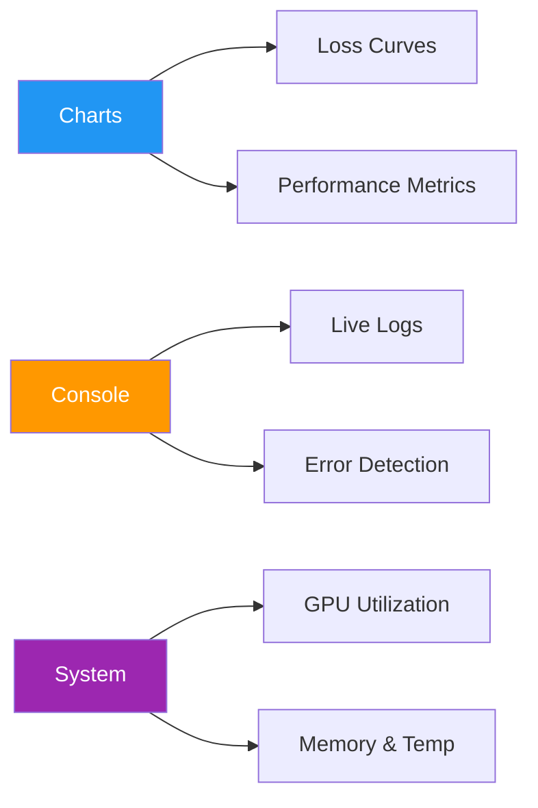

# Model Training

[Ultralytics Platform](https://platform.ultralytics.com) provides comprehensive tools for training YOLO models, from organizing experiments to running cloud training jobs with real-time metrics streaming.

## Overview

The Training section helps you:

- **Organize** models into [projects](projects.md) for easier management
- **Train** on cloud GPUs with a single click
- **Monitor** real-time metrics during training
- **Compare** model performance across experiments
- **Export** to 17+ deployment formats (see [supported formats](models.md#supported-formats))


## Workflow

```mermaid
graph LR
    A[📁 Project] --> B[⚙️ Configure]
    B --> C[🚀 Train]
    C --> D[📈 Monitor]
    D --> E[📦 Export]

    style A fill:#4CAF50,color:#fff
    style B fill:#2196F3,color:#fff
    style C fill:#FF9800,color:#fff
    style D fill:#9C27B0,color:#fff
    style E fill:#00BCD4,color:#fff
```



| Stage         | Description                                                                |
| ------------- | -------------------------------------------------------------------------- |
| **Project**   | Create a workspace to organize related models                              |
| **Configure** | Select [dataset](../data/datasets.md), base model, and training parameters |
| **Train**     | Run on cloud GPUs or your local hardware                                   |
| **Monitor**   | View real-time loss curves and metrics                                     |
| **Export**    | Convert to 17+ deployment formats ([details](models.md#supported-formats)) |

## Training Options

Ultralytics Platform supports multiple training approaches:

| Method                                                  | Description                                   | Best For                   |
| ------------------------------------------------------- | --------------------------------------------- | -------------------------- |
| **[Cloud Training](cloud-training.md)**                 | Train on Ultralytics Cloud GPUs               | No local GPU, scalability  |
| **[Local Training](cloud-training.md#remote-training)** | Train locally, stream metrics to the platform | Existing hardware, privacy |
| **[Colab Training](cloud-training.md#remote-training)** | Use Google Colab with platform integration    | Free GPU access            |

## GPU Options

Available GPUs for cloud training on Ultralytics Cloud:

| GPU          | VRAM   | Cost/Hour | Best For                  |
| ------------ | ------ | --------- | ------------------------- |
| RTX 2000 Ada | 16 GB  | $0.24     | Small datasets, testing   |
| RTX A4500    | 20 GB  | $0.24     | Small-medium datasets     |
| RTX A5000    | 24 GB  | $0.26     | Medium datasets           |
| RTX 4000 Ada | 20 GB  | $0.38     | Medium datasets           |
| L4           | 24 GB  | $0.39     | Inference optimized       |
| A40          | 48 GB  | $0.40     | Larger batch sizes        |
| RTX 3090     | 24 GB  | $0.46     | Great price/performance   |
| RTX A6000    | 48 GB  | $0.49     | Large models              |
| RTX 4090     | 24 GB  | $0.59     | Best price/performance    |
| RTX 6000 Ada | 48 GB  | $0.77     | Large batch training      |
| L40S         | 48 GB  | $0.86     | Large batch training      |
| RTX 5090     | 32 GB  | $0.89     | Latest generation         |
| L40          | 48 GB  | $0.99     | Large models              |
| A100 PCIe    | 80 GB  | $1.39     | Production training       |
| A100 SXM     | 80 GB  | $1.49     | Production training       |
| RTX PRO 6000 | 96 GB  | $1.89     | Recommended default       |
| H100 PCIe    | 80 GB  | $2.39     | High-performance training |
| H100 SXM     | 80 GB  | $2.69     | Fastest training          |
| H100 NVL     | 94 GB  | $3.07     | Maximum performance       |
| H200 NVL     | 143 GB | $3.39     | Maximum memory            |
| H200 SXM     | 141 GB | $3.59     | Maximum performance       |
| B200         | 180 GB | $4.99     | Largest models            |

!!! tip "Signup Credits"

    New accounts receive signup credits for training. Check [Billing](../account/billing.md) for details.

## Real-Time Metrics

During training, view live metrics across three subtabs:



| Subtab      | Metrics                                                |
| ----------- | ------------------------------------------------------ |
| **Charts**  | Box/class/DFL loss, mAP50, mAP50-95, precision, recall |
| **Console** | Live training logs with ANSI color and error detection |
| **System**  | GPU utilization, memory, temperature, CPU, disk        |

!!! info "Automatic Checkpoints"

    The Platform automatically saves checkpoints at every epoch. The **best model** (highest mAP) and **final model** are always preserved.

## Quick Start

Get started with cloud training in under a minute:

=== "Cloud (UI)"

    1. Create a project in the sidebar
    2. Click **New Model**
    3. Select a model, dataset, and GPU
    4. Click **Start Training**

=== "Remote (CLI)"

    ```bash
    export ULTRALYTICS_API_KEY="your_api_key"
    yolo train model=yolo26n.pt data=ul://username/datasets/my-dataset \
      epochs=100 project=username/my-project name=exp1
    ```

=== "Remote (Python)"

    ```python
    from ultralytics import YOLO

    model = YOLO("yolo26n.pt")
    model.train(
        data="ul://username/datasets/my-dataset",
        epochs=100,
        project="username/my-project",
        name="exp1",
    )
    ```

## Quick Links

- [**Projects**](projects.md): Organize your models and experiments
- [**Models**](models.md): Manage trained checkpoints
- [**Cloud Training**](cloud-training.md): Train on cloud GPUs

## FAQ

### How long does training take?

Training time depends on:

- Dataset size (number of images)
- Model size (n, s, m, l, x)
- Number of epochs
- GPU type selected

A typical training run with 1000 images, YOLO26n, 100 epochs on RTX PRO 6000 takes about 2-3 hours. Smaller runs (500 images, 50 epochs on RTX 4090) complete in under an hour. See [cost examples](cloud-training.md#cost-examples) for detailed estimates.

### Can I train multiple models simultaneously?

Yes. Concurrent cloud training limits depend on your plan: Free allows 3, Pro allows 10, and Enterprise is unlimited. For additional parallel training, use remote training from multiple machines.

### What happens if training fails?

If training fails:

1. Checkpoints are saved at each epoch
2. You can resume from the last checkpoint
3. Credits are only charged for completed compute time

### How do I choose the right GPU?

| Scenario                      | Recommended GPU  |
| ----------------------------- | ---------------- |
| Most training jobs            | RTX PRO 6000     |
| Large datasets or batch sizes | H100 SXM or H200 |
| Budget-conscious              | RTX 4090         |
