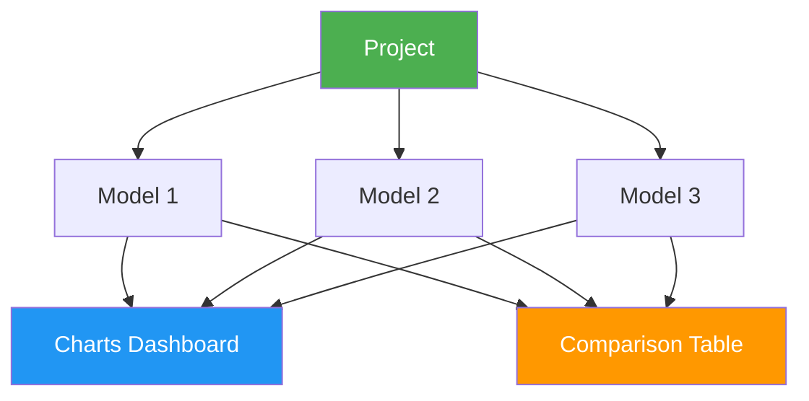

# Projects

[Ultralytics Platform](https://platform.ultralytics.com) projects provide an effective solution for organizing and managing your models. Group related models together to facilitate easier management, comparison, and development.

## Create Project

Navigate to **Projects** in the sidebar and click **Create Project**.

??? tip "Quick Create"

    You can also create a project from the Home page quick actions.

Enter your project details:

- **Name**: A descriptive name for your project (a random name is auto-generated)
- **Description**: Optional notes about the project purpose
- **Visibility**: Public (anyone can view) or Private (only you can access)
- **License**: Optional license for your project (AGPL-3.0, Apache-2.0, MIT, GPL-3.0, BSD-3-Clause, LGPL-3.0, MPL-2.0, EUPL-1.1, Unlicense, Ultralytics-Enterprise, and more)

Click **Create** to finalize. Your new project appears in the Projects list and sidebar.

## Project Page

The project page has two main areas:

| Area               | Description                                                                                                         |
| ------------------ | ------------------------------------------------------------------------------------------------------------------- |
| **Models Sidebar** | Resizable list of all models in the project with search, status filters, sort options, and checkboxes for selection |
| **Main Panel**     | Charts dashboard or comparison table (toggle between views)                                                         |

### Project Header

The header displays:

- **Project icon** (customizable color, letter, or uploaded image)
- **Editable name** (click to rename; slug auto-updates)
- **License badge**
- **Model count**, completed/running/failed counts, total size
- **Clone count** and **last updated** timestamp
- **Description** (click to edit)

Action buttons in the header:

| Button        | Description                                    |
| ------------- | ---------------------------------------------- |
| **New Model** | Opens the [training dialog](cloud-training.md) |
| **Clone**     | Clone project and all models (public projects) |
| **Star**      | Star/unstar the project                        |
| **Share**     | Social sharing for public projects             |
| **Refresh**   | Refresh project data                           |
| **Delete**    | Move project to trash                          |

### View Modes

Toggle between two view modes using the view controls:

- **Charts view**: Interactive charts dashboard showing loss curves and metric comparisons for selected models
- **Table view**: Comparison table showing training arguments and final metrics side-by-side with a diff mode to highlight differing columns

### Models Sidebar

The resizable sidebar lists all models in the project:

- **Checkboxes** to select which models appear in charts/table
- **Search** to filter models by name
- **View options** for status filter (All, Completed, Running, Starting, Pending, Failed, Cancelled), grouping by task, and sort order
- **Drag and drop** `.pt` files directly onto the sidebar to upload models ([model upload details](models.md#upload-model))
- **Training progress** shown for running models (epoch count and progress bar)

Click any model to open its [model page](models.md).

## Project Icon

Customize your project icon:

1. Click the icon next to the project name
2. Choose a **color** and **letter**, or upload a custom **image**
3. Changes save automatically

## Visibility Settings

Control who can see your project:

| Setting     | Description                                      |
| ----------- | ------------------------------------------------ |
| **Public**  | Anyone can view on [Explore](../explore.md) page |
| **Private** | Only you and collaborators                       |

## Share with Collaborators

Share private projects with other users:

1. Click the **Share** button on the project page
2. Enter the collaborator's username or email
3. Set their role
4. Click **Invite**

Collaborators with editor access can upload models and start training within your project. See [Teams](../account/settings.md#teams-tab) for role permissions.

## Clone Project

Clone a public project to your own account:

1. Visit the public project page
2. Click **Clone Project**
3. The project and all its models are copied to your account as a private project

!!! info "Clone Behavior"

    Cloned projects are always created as **private** in your account. The clone count is displayed on the original project. If the original has a copyleft license (e.g., AGPL-3.0), the clone inherits and locks that license.

## Compare Models

### Charts Dashboard

Compare model performance using the charts dashboard:

1. Select models in the sidebar using checkboxes
2. View overlaid metric curves grouped by type (metrics, train loss, validation loss, learning rate)
3. Drag charts to rearrange, resize by dragging edges
4. Hover to see exact values, click legend items to hide/show models, click a model line to navigate to that model

Available chart groups:

| Group             | Charts                                         |
| ----------------- | ---------------------------------------------- |
| **Metrics**       | mAP50, mAP50-95, precision, recall             |
| **Train Loss**    | train/box_loss, train/cls_loss, train/dfl_loss |
| **Val Loss**      | val/box_loss, val/cls_loss, val/dfl_loss       |
| **Learning Rate** | lr/pg0, lr/pg1, lr/pg2                         |

!!! tip "Interactive Charts"

    - Hover to see exact values
    - Click legend items to hide/show models
    - Drag to zoom into specific regions
    - Click a model line to navigate to that model's page
    - Rearrange and resize charts; layout persists across sessions

### Comparison Table

Switch to table view for side-by-side comparison of training arguments and final metrics:

1. Click the **Table** view mode toggle
2. See all selected models as rows with training args and metrics as columns
3. Use the **Diff** button to highlight only columns where values differ across models

## Upload Models

Upload existing `.pt` model files:

1. **Drag and drop** files onto the project page or models sidebar
2. Multiple files can be uploaded simultaneously (up to 3 concurrent uploads)
3. Model metadata (task, architecture, class names, training results) is parsed automatically from the `.pt` file
4. Charts update instantly from locally parsed data while the upload completes in the background

!!! example "Supported Files"

    Only PyTorch `.pt` files from Ultralytics YOLO training are supported. The Platform parses embedded metadata including training results, arguments, task type, and class names. See [Models](models.md) for format details.

## Edit Project

Update project name, description, or settings:

1. Click the project name to edit it inline
2. Click the description to edit it inline
3. Click the icon to customize it
4. Click the license badge to change the license

## Delete Project

Remove a project you no longer need:

1. Click the **Delete** button (trash icon) in the header
2. Confirm deletion

!!! warning "Cascading Delete"

    Deleting a project also deletes all models inside it. This action moves items to [Trash](../account/trash.md) where they can be restored within 30 days.

## FAQ

### How many models can a project contain?

There's no hard limit on models per project. However, for better organization, we recommend:

- Group related experiments (same dataset/task)
- Archive old experiments
- Use meaningful project names

### Can I restore a deleted project?

Yes, deleted projects go to Trash and can be restored within 30 days:

1. Go to [Settings > Trash](../account/trash.md)
2. Find the project
3. Click **Restore**

### Can I transfer models between projects?

Yes, you can clone a model to a different project using the clone model dialog from the [model page](models.md#clone-model).
